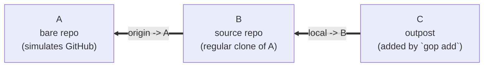

# Git Outpost — Architecture

> **Spec:** [product.md](product.md)
> **Audience:** implementers and reviewers. Assumes familiarity with Rust,
> Cargo, Git internals, and `clap`. Every type, file path, and decision is
> named explicitly — no placeholders, no "TBD", no forward-references that
> rely on the reader to fill in detail.

This document describes how the Git Outpost tool will be built. It covers
crate layout, module boundaries, key types, error handling, the CLI surface,
configuration storage, the test strategy, and a complete numbered test
inventory. It does **not** prescribe step-by-step TDD tasks; that is the job
of a separate execution plan written after this architecture is approved.

---

## 1. Goals & Non-Goals (recap from spec)

The tool creates and manages self-contained Git checkouts ("outposts")
from an existing local repository. An outpost is a normal `git clone` — it
has its own `.git` directory, no shared object store, and no `.git` pointer
files. The source repository acts as the outpost's local remote (`local`
by default). Every outpost can be reasoned about as a normal Git
repository by editors, devcontainers, and CLIs.

**Non-goals** (per spec): not replacing Git, not implementing a custom
object store, not hiding Git behavior, not requiring a particular hosting
provider.

---

## 2. Topology — A / B / C



- **A** is a bare repository, simulating a remote like GitHub.
- **B** is a normal clone of A. It has `origin -> A`. From the spec's
  perspective B is "the source repository" — the repository that the user
  invokes `gop` from.
- **C** is an outpost added by `gop add` from inside B. It has its
  own `.git` directory and `local -> B`. Editors and devcontainers see C
  as a self-contained Git repo.

This topology is the canonical fixture for integration tests (see §10).

---

## 3. Crate Layout

A Cargo workspace with two crates. Repository-level integration tests live
inside the CLI crate's `tests/` directory (Cargo's standard location for
binary-crate integration tests).

```
git-outpost/                       # repo root
├── Cargo.toml                       # [workspace] manifest
├── Cargo.lock
├── README.md                        # links to docs
├── docs/                             # mdbook source tree
│   ├── book.toml                     # mdbook configuration
│   ├── .assets/                      # mdbook-mermaid assets
│   └── src/
│       ├── SUMMARY.md                # mdbook table of contents
│       ├── product.md                # the product spec
│       └── architecture.md           # this document
├── crates/
│   ├── core/                        # outpost-core (library)
│   │   ├── Cargo.toml
│   │   ├── src/
│   │   │   ├── lib.rs               # re-exports public surface
│   │   │   ├── error.rs             # OutpostError, OutpostResult
│   │   │   ├── git.rs               # GitInvoker subprocess wrapper
│   │   │   ├── refname.rs           # validated BranchName / RefName / RemoteName / SourceRemoteRef / UpstreamRef
│   │   │   ├── reporter.rs          # Reporter trait + StepKind
│   │   │   ├── source_repo.rs       # SourceRepo type + helpers
│   │   │   ├── outpost.rs           # Outpost type + helpers
│   │   │   ├── config.rs            # source-owned .outpost config JSON store
│   │   │   ├── metadata.rs          # outpost.* git config keys (always --local)
│   │   │   ├── outpost_id.rs        # derived registry-scoped outpost ID aliases
│   │   │   ├── registry.rs          # source .outpost registry JSON store
│   │   │   ├── safety.rs            # dirty/divergence/path checks
│   │   │   ├── selector.rs          # path-or-ID outpost selector resolution
│   │   │   └── ops/                 # one file per command
│   │   │       ├── mod.rs
│   │   │       ├── add.rs
│   │   │       ├── list.rs
│   │   │       ├── lock.rs
│   │   │       ├── move.rs
│   │   │       ├── status.rs
│   │   │       ├── source.rs
│   │   │       ├── pull.rs
│   │   │       ├── merge.rs
│   │   │       ├── rebase.rs
│   │   │       ├── push.rs
│   │   │       ├── remove.rs
│   │   │       ├── prune.rs
│   │   │       └── unlock.rs
│   │   └── tests/
│   │       ├── common/              # AbcFixture (shared)
│   │       │   ├── mod.rs
│   │       │   └── fixture.rs
│   │       ├── add.rs
│   │       ├── list.rs
│   │       ├── lock_move_unlock.rs
│   │       ├── status.rs
│   │       ├── source.rs
│   │       ├── pull.rs
│   │       ├── merge.rs
│   │       ├── rebase.rs
│   │       ├── push.rs
│   │       ├── remove.rs
│   │       └── prune.rs
│   └── cli/                         # CLI crate/package: git-outpost
│       ├── Cargo.toml
│       ├── src/
│       │   ├── main.rs              # entry point: parse + dispatch
│       │   ├── cli.rs               # clap definitions
│       │   ├── output.rs            # formatting / colors / tables
│       │   ├── exit.rs              # OutpostError -> ExitCode mapping
│       │   └── reporter_impls.rs    # StderrReporter
│       └── tests/
│           ├── common/mod.rs        # CLI fixture wrapping AbcFixture
│           ├── e2e.rs               # round-trip and binary-name tests
│           ├── flags.rs             # exit codes, --no-color, etc.
│           └── help.rs              # help text snapshots
```

**Rationale:**
- The user explicitly asked for a library crate. `outpost-core` is the
  Rust-idiomatic split for "logic that other tools could call" and forces
  a clean boundary.
- The CLI crate stays focused on argv parsing and output formatting. All
  Git logic lives in `core`.
- Two `[[bin]]` entries in `crates/cli/Cargo.toml` (see §6.3) install both
  `git-outpost` and `gop` from one source.

---

## 4. CLI Library Choice

**`clap` v4 with derive macros.** Rationale:

- De facto standard in modern Rust CLIs (cargo, rustup, ripgrep, fd, bat,
  uv, hyperfine, watchexec).
- Derive macros let us define the entire command tree as Rust types.
- Built-in `--help` generation, subcommand routing, value validation,
  error formatting, and shell completion via `clap_complete`.
- Stable, MSRV-compatible, well-documented.

No serious alternative for a tool of this complexity (`structopt` merged
into `clap`; `argh` and `gumdrop` are too minimal).

---

## 5. Module Structure (core crate)

### 5.1 `error.rs`

```rust
use std::path::PathBuf;
use thiserror::Error;

pub type OutpostResult<T> = Result<T, OutpostError>;

#[derive(Debug, Error)]
pub enum OutpostError {
    #[error("not inside a Git repository: {0}")]
    NotARepo(PathBuf),

    #[error("not inside a managed outpost: {0}")]
    NotAnOutpost(PathBuf),

    #[error("source repository not found at {0}")]
    SourceMissing(PathBuf),

    #[error("{command} must be run from {expected}; effective cwd is {cwd}")]
    WrongContext { command: &'static str, expected: &'static str, cwd: PathBuf },

    #[error("{command} requires <outpost> when run from source repository {cwd}")]
    MissingOutpostPath { command: &'static str, cwd: PathBuf },

    #[error("destination already exists: {0}")]
    DestinationExists(PathBuf),

    #[error("destination {0} is inside an existing Git repository")]
    DestinationInsideRepo(PathBuf),

    #[error("working tree is dirty in {repo}; {hint}")]
    DirtyTree { repo: PathBuf, hint: &'static str },

    #[error("branch {branch} has unpushed commits in {repo}; {hint}")]
    UnpushedCommits { repo: PathBuf, branch: String, hint: &'static str },

    #[error("history diverges from source repository on branch {branch}")]
    Divergence { branch: String },

    #[error("branch not found: {branch} in {repo}")]
    BranchNotFound { branch: String, repo: PathBuf },

    #[error("no upstream tracking configured for branch {branch}")]
    NoUpstreamTracking { branch: String },

    #[error("upstream is not a branch ref (got {merge_ref}); cannot synchronize from a non-branch upstream")]
    UpstreamNotABranch { merge_ref: String },

    #[error("invalid ref name: {name}")]
    InvalidRefName { name: String },

    #[error("source repository {source} has {branch} checked out; cannot push to a non-bare checked-out branch (configure receive.denyCurrentBranch=updateInstead on the source, or check out a different branch in the source)")]
    PushIntoCheckedOutBranch { source: PathBuf, branch: String },

    #[error("branch {branch} does not exist on the source repository")]
    AmbiguousBranchCreation { branch: String },

    #[error("outpost is locked: {path}{reason}")]
    OutpostLocked { path: PathBuf, reason: String },

    #[error("registry entry path is not a managed outpost of this source: {0}")]
    RegistryEntryNotManaged(PathBuf),

    #[error("registry entry not found: {0}")]
    RegistryEntryNotFound(PathBuf),

    #[error("outpost id prefix not found: {0}")]
    OutpostIdPrefixNotFound(String),

    #[error("outpost id prefix is ambiguous: {0}")]
    OutpostIdPrefixAmbiguous(String),

    #[error("outpost selector is ambiguous: {0}")]
    OutpostSelectorAmbiguous(String),

    #[error("invalid registry file at {path}: {reason}")]
    BadRegistry { path: PathBuf, reason: String },

    #[error("invalid outpost metadata at {outpost}: {reason}")]
    BadMetadata { outpost: PathBuf, reason: String },

    #[error("git command failed: `git {args}` (exit {code}): {stderr}")]
    GitFailed { args: String, code: i32, stderr: String },

    #[error("git command terminated by signal: `git {args}`{signal_str}")]
    GitTerminatedBySignal { args: String, signal_str: String },   // signal_str = " (signal N)" on Unix, "" on Windows

    #[error("io error at {path}: {source}")]
    IoAt { path: PathBuf, source: std::io::Error },
}
```

**Decoupled hints.** `DirtyTree` and `UnpushedCommits` carry a `hint:
&'static str` field that the calling op fills in (for example,
`"pass --force"` for `remove`/`move`). Hints are not baked into
`Display` strings.

**No catchall.** Every realistic failure has a specific variant. If a new
failure mode appears during implementation, it adds a new variant rather
than dumping into a generic `Other` or `Io`.

**`IoAt`** wraps every file-system error with the path it concerned. There
is no `#[from] std::io::Error` — every call site explicitly maps with the
path it was operating on. This is enforced by code review (no automatic
conversion).

**Exit-code mapping** is in §9.

### 5.2 `git.rs` — `GitInvoker`

A thin wrapper around `std::process::Command`. Responsibilities:

- Pin the working directory (`Command::current_dir`).
- Inject overrides like `GIT_CONFIG_GLOBAL` for hermetic tests.
- Capture stdout/stderr.
- Return `OutpostError::GitFailed` (with the exact argv preserved) on non-zero
  exit.

```rust
use std::ffi::{OsStr, OsString};
use std::path::{Path, PathBuf};
use std::collections::BTreeMap;

#[derive(Clone)]
pub struct GitInvoker {
    cwd: PathBuf,
    env: BTreeMap<OsString, OsString>,
}

impl GitInvoker {
    pub fn at(cwd: impl Into<PathBuf>) -> Self;
    pub fn with_env(self, key: impl Into<OsString>, val: impl Into<OsString>) -> Self;
    pub fn cwd(&self) -> &Path;

    /// Run `git <args>` and return trimmed stdout.
    pub fn run_capture<I, S>(&self, args: I) -> OutpostResult<String>
    where I: IntoIterator<Item = S>, S: AsRef<OsStr>;

    /// Run `git <args>`; succeed or fail. Stdout is discarded.
    pub fn run_check<I, S>(&self, args: I) -> OutpostResult<()>
    where I: IntoIterator<Item = S>, S: AsRef<OsStr>;

    /// Test-helper: returns the argvs that have been invoked since this
    /// `GitInvoker` was constructed. C-11d, C-16, and U-09 use this to
    /// assert specific argv shapes (e.g., `--no-shared` is always
    /// present, `protocol.file.allow=user` is always set).
    ///
    /// **Visibility model.** This method, plus the `test_invoker`
    /// accessors on `SourceRepo` (§5.4) and `Outpost` (§5.5), are
    /// gated behind a `test-helpers` Cargo feature on `outpost-core`:
    ///
    /// ```toml
    /// [features]
    /// test-helpers = []
    /// ```
    ///
    /// Each accessor is declared as
    /// `#[cfg(any(test, feature = "test-helpers"))] pub fn ...`.
    /// Plain `pub` (NOT `pub(crate)`) is required because integration
    /// tests in `crates/core/tests/*.rs` link `outpost-core` as
    /// an external crate and cannot reach `pub(crate)` items.
    ///
    /// **How tests enable it.** `crates/core/Cargo.toml`'s
    /// `[dev-dependencies]` declares `outpost-core = { path = ".",
    /// features = ["test-helpers"] }` so integration tests get the
    /// feature without exposing it to production consumers. The
    /// fixture (§10.2) calls `source.test_invoker()` to read the log.
    ///
    /// Unit tests inside `crates/core/src/*.rs` can additionally rely
    /// on `#[cfg(test)]` (the `any(...)` arm covers them).
    #[cfg(any(test, feature = "test-helpers"))]
    pub fn argv_log(&self) -> Vec<Vec<std::ffi::OsString>>;

    /// Run `git <args>` for boolean predicates like `git diff --quiet`.
    /// Returns:
    /// - Ok(true)  on exit 0
    /// - Ok(false) on exit 1 (the conventional "negative answer" code)
    /// - Err(GitFailed)  on any other non-zero code (real failure)
    /// - Err(GitTerminatedBySignal)  if the child died without an exit code
    ///
    /// This distinction matters: `git diff --quiet` exits 1 when there
    /// are differences, but exit 128 (e.g., not a git repo) is a real
    /// error, not a "yes there are differences" answer.
    pub fn run_status<I, S>(&self, args: I) -> OutpostResult<bool>
    where I: IntoIterator<Item = S>, S: AsRef<OsStr>;
}
```

**Argument-injection rule.** Every public op that accepts user-supplied
refs, branches, or paths must pass them via the validated newtypes from
`refname.rs` (§5.3) **or** with an explicit `"--"` separator inserted
before the user value. There is no string-formatted argv in this codebase.

`with_env` is what the test fixture (§10.2) uses to inject
`GIT_CONFIG_GLOBAL`, `GIT_CONFIG_SYSTEM`, `GIT_AUTHOR_NAME`,
`GIT_AUTHOR_EMAIL`, `GIT_COMMITTER_NAME`, `GIT_COMMITTER_EMAIL`, and
`GIT_TERMINAL_PROMPT=0` for hermetic, deterministic tests.

`GitInvoker` is `Clone` so `SourceRepo` and `Outpost` can hand out
copies for new ops without rebuilding the env map.

### 5.3 `refname.rs` — validated newtypes

User input that ends up on a `git` argv is validated at the boundary,
not at the call site. There are **four** distinct categories, because
they have different validation rules:

```rust
/// A branch name (for `git checkout <branch>`, `git push ... <branch>`).
/// Validated with `git check-ref-format --branch`.
pub struct BranchName(String);

/// A fully-qualified ref like `refs/heads/main` or `refs/tags/v1.0`.
/// Validated with `git check-ref-format`.
pub struct RefName(String);

/// A remote name (e.g. `origin`, `local`, `upstream`).
/// Validated with regex `^[A-Za-z0-9._-]+$` and rejection of leading `-`.
pub struct RemoteName(String);

/// A source-remote branch ref in the Story form `local/main`.
/// Parsed as `<remote>/<branch>` and validated as a `RemoteName` plus
/// `BranchName`.
pub struct SourceRemoteRef {
    pub remote: RemoteName,
    pub branch: BranchName,
}

/// A binding between a remote and a ref on that remote, as used by
/// Git's upstream tracking config (`branch.<name>.remote` +
/// `branch.<name>.merge`). `branch.<name>.merge` is stored by Git as
/// a fully-qualified ref like `refs/heads/main`, **not** as a short
/// branch name. `UpstreamRef::merge_ref` therefore holds a `RefName`,
/// and the architecture provides `UpstreamRef::short_branch()` for the
/// common case of pulling out the trailing branch component.
pub struct UpstreamRef {
    pub remote: RemoteName,
    pub merge_ref: RefName,           // e.g. "refs/heads/main"
}

impl UpstreamRef {
    /// Returns the branch portion of `merge_ref` if it is under
    /// `refs/heads/`. Returns `None` for non-branch refs; the caller
    /// must handle this before using the value as a branch.
    pub fn short_branch(&self) -> Option<&str>;
}
```

Each type rejects names starting with `-` at construction. Once
constructed, the inner `&str` is safe to pass to `git` as a positional
argument. **`--` is not used as a generic "ref injection guard"** in
this codebase; that is a path-only convention. Argv-injection defense
comes from validated newtypes (this section) plus restricted argv
shapes per call (§5.2).

`SourceRemoteRef` rejects inputs without a `/` separator. `gop merge`
and `gop rebase` additionally require the remote component to match the
outpost's configured source remote.

### 5.4 `source_repo.rs` — `SourceRepo`

```rust
pub struct SourceRepo {
    work_tree: PathBuf,        // canonicalized
    git_dir: PathBuf,          // canonicalized; from `git rev-parse --git-dir` (worktree-specific for worktrees)
    git_common_dir: PathBuf,   // canonicalized; from `git rev-parse --git-common-dir` (shared across worktrees)
    git: GitInvoker,
    env: BTreeMap<OsString, OsString>,    // remembered for child SourceRepo/Outpost construction
}

impl SourceRepo {
    pub fn discover(start: &Path) -> OutpostResult<Self>;          // uses `git rev-parse --show-toplevel`, `--git-dir`, `--git-common-dir`
    pub fn discover_with(start: &Path, env: &BTreeMap<OsString, OsString>) -> OutpostResult<Self>;
    pub fn at(path: impl Into<PathBuf>) -> OutpostResult<Self>;
    pub fn at_with(path: impl Into<PathBuf>, env: &BTreeMap<OsString, OsString>) -> OutpostResult<Self>;
    pub fn work_tree(&self) -> &Path;
    pub fn git_dir(&self) -> &Path;
    pub fn git_common_dir(&self) -> &Path;
    /// Internal helper: opens an outpost at `path`, threading
    /// `self.env` so the created `Outpost` inherits the same
    /// hermetic env in tests. Used by safety helpers and ops; this
    /// is what closes the env-leakage gap that bare `Outpost::at`
    /// would create.
    pub fn outpost_at(&self, path: &Path) -> OutpostResult<Outpost>;
    pub fn env(&self) -> &BTreeMap<OsString, OsString>;

    /// Test-helper accessor for the internal `GitInvoker`'s `argv_log`
    /// (see §5.2). Gated behind `#[cfg(any(test, feature = "test-helpers"))]`
    /// and declared `pub` (not `pub(crate)`) so external integration
    /// tests in `crates/core/tests/*.rs` can call it.
    #[cfg(any(test, feature = "test-helpers"))]
    pub fn test_invoker(&self) -> &GitInvoker;
    pub fn current_branch(&self) -> OutpostResult<BranchName>;
    pub fn checked_out_branches(&self) -> OutpostResult<Vec<BranchName>>;   // includes worktrees
    pub fn checked_out_worktree_for(&self, branch: &BranchName) -> OutpostResult<Option<PathBuf>>;
    pub fn is_dirty(&self) -> OutpostResult<bool>;
    /// Returns `UpstreamRef { remote, merge_ref }` for the local branch's
    /// tracked upstream, with `merge_ref` as a fully-qualified ref such as
    /// `refs/heads/main`.
    /// `None` if the branch has no upstream tracking configured.
    pub fn upstream_for(&self, branch: &BranchName) -> OutpostResult<Option<UpstreamRef>>;
    pub fn branch_exists(&self, branch: &BranchName) -> OutpostResult<bool>;
    /// Fast-forward a source branch from `origin/<branch>` without
    /// switching the source checkout. Used by `gop pull` and
    /// `gop source pull`.
    pub fn fast_forward_branch_from_origin(&self, branch: &BranchName) -> OutpostResult<()>;
    pub fn registry(&self) -> OutpostResult<Registry>;
    pub fn registry_mut(&self) -> OutpostResult<RegistryMut<'_>>;          // borrows self for the lifetime of the guard
    pub fn registry_path(&self) -> PathBuf;                                // <work_tree>/.outpost/registry.json
}
```

Discovery uses Git itself (`git rev-parse --show-toplevel` and
`--git-dir`), which transparently handles every layout Git supports:
normal `.git` directory, `.git` file (worktrees), `--git-dir`
overrides via env vars, etc. We do **not** roll our own `.git`
walker.

`work_tree` and `git_dir` are canonicalized at construction
(`std::fs::canonicalize`) so registry paths and registry lookups are
consistent.

`checked_out_branches` returns the set of branches currently checked
out in the source repo and any of its worktrees. This is what
`ops::push` uses to decide whether the target branch is safe to push
to (see §5.9.8).

### 5.5 `outpost.rs` — `Outpost`

```rust
pub struct Outpost {
    work_tree: PathBuf,        // canonicalized
    git_dir: PathBuf,          // canonicalized
    git: GitInvoker,
    metadata: Metadata,
    env: BTreeMap<OsString, OsString>,    // remembered for child SourceRepo construction
}

impl Outpost {
    pub fn discover(start: &Path) -> OutpostResult<Self>;
    pub fn discover_with(start: &Path, env: &BTreeMap<OsString, OsString>) -> OutpostResult<Self>;
    pub fn at(path: impl Into<PathBuf>) -> OutpostResult<Self>;        // verifies outpost.managed=true; else NotAnOutpost
    pub fn at_with(path: impl Into<PathBuf>, env: &BTreeMap<OsString, OsString>) -> OutpostResult<Self>;
    pub fn work_tree(&self) -> &Path;
    pub fn metadata(&self) -> &Metadata;
    pub fn source_repo(&self) -> OutpostResult<SourceRepo>;            // resolves stored path; threads self.env; SourceMissing if gone
    pub fn current_branch(&self) -> OutpostResult<BranchName>;
    pub fn is_dirty(&self) -> OutpostResult<bool>;
    pub fn ahead_behind_source(&self) -> OutpostResult<AheadBehind>;
    pub fn unpushed_commits(&self, source: &SourceRepo) -> OutpostResult<u32>;
    /// Reads `branch.<current>.remote` and `branch.<current>.merge` and
    /// returns an `UpstreamRef`. `None` if either key is unset.
    /// Used by status reports to show whether ordinary Git source
    /// tracking is configured.
    pub fn upstream_tracking(&self) -> OutpostResult<Option<UpstreamRef>>;

    /// Test-helper accessor for the internal `GitInvoker`'s `argv_log`
    /// (see §5.2). Gated behind `#[cfg(any(test, feature = "test-helpers"))]`
    /// and declared `pub` (not `pub(crate)`) so external integration
    /// tests in `crates/core/tests/*.rs` can call it.
    #[cfg(any(test, feature = "test-helpers"))]
    pub fn test_invoker(&self) -> &GitInvoker;
}

pub struct AheadBehind { pub ahead: u32, pub behind: u32 }
```

Named `AheadBehind` struct rather than `(u32, u32)` so positional swaps
don't slip through review.

### 5.6 `metadata.rs`

Reads/writes the spec-defined config keys via `git config`. Two types,
because `status` needs to inspect broken outposts while ops need validated
values:

```rust
/// Lenient read result — every field is optional. Used by status reporting.
pub struct RawMetadata {
    pub managed: Option<bool>,
    pub source_repo: Option<PathBuf>,
    pub remote_name: Option<RemoteName>,
}

/// Validated metadata. All fields present, `managed == true`.
/// Constructed only via `Metadata::from_raw` after explicit checks.
pub struct Metadata {
    pub source_repo: PathBuf,           // canonicalized when written
    pub remote_name: RemoteName,
}

impl RawMetadata {
    /// Reads each key independently using `git config --local --get
    /// <key>`. **The `--local` scope is mandatory.** Without it, `git
    /// config --get` would also read the user's `~/.gitconfig` and the
    /// system gitconfig — so a globally set `outpost.managed=true`
    /// would make every repository appear managed. The architecture's
    /// "is this an outpost?" gate is broken without `--local`.
    ///
    /// **Distinguishes** the two `git config` exit codes: 1 (key not
    /// present) yields `None` for that field; 128 (e.g., not in a Git
    /// repo) propagates as `NotARepo` / `GitFailed`. Uses
    /// `GitInvoker::run_status`'s contract (§5.2): exit 0 → present,
    /// exit 1 → absent, anything else → real error.
    pub fn read(git: &GitInvoker) -> OutpostResult<Self>;
}

impl Metadata {
    /// Promotes a `RawMetadata` to a validated `Metadata`. Takes the
    /// outpost path so it can be embedded in `BadMetadata` errors
    /// when a key is unexpectedly missing. Returns:
    /// - `NotAnOutpost(outpost.into())` if `managed` is missing or false
    /// - `BadMetadata { outpost, reason }` if `managed == true` but
    ///   `source_repo` or `remote_name` is missing (broken outpost)
    /// - `Ok(Metadata { ... })` otherwise.
    pub fn from_raw(outpost: &Path, raw: RawMetadata) -> OutpostResult<Self>;

    /// Writes via `git config --local <key> <value>` for each required key.
    /// `--local` is mandatory for the same reason as `read`.
    pub fn write(&self, git: &GitInvoker) -> OutpostResult<()>;
}
```

Keys (per spec):

```
outpost.managed       bool ("true"/"false")
outpost.sourceRepo    absolute canonicalized path
outpost.remoteName    remote name (defaults to "local")
```

A test (U-14) asserts that a globally-set `outpost.managed=true`
does **not** make an unmanaged repo appear managed.

**Layering:**
- `Outpost::at` reads `RawMetadata`, checks `managed == true`, and
  promotes to `Metadata` via `from_raw`. Surfaces `NotAnOutpost` on
  the unmanaged case and a configuration problem on the broken-managed
  case (managed but missing keys).
- `ops::status::run` reads `RawMetadata` directly so it can report
  **what** is broken rather than failing.

### 5.7 `registry.rs`

Storage path:

```
<source.work_tree>/.outpost/registry.json
```

The registry is mandatory source-owned operational state. It is the
Git Outpost analogue to Git's own `.git/worktrees` registry, but it
lives in the source checkout so the relationship is visible and
portable with the source working tree.

This deliberately uses `work_tree`, not `git_common_dir`. If the source
is itself a Git worktree, the registry lives in that source checkout's
`.outpost/` directory, not in the parent's shared `.git` metadata.
Outposts added from different sibling worktrees therefore have
separate registries, matching the concrete source path stored in each
outpost's `outpost.sourceRepo` metadata.

On first write, `registry.rs` creates `<source.work_tree>/.outpost/`
and ensures `.outpost/` is ignored by the source repository's local Git
ignore mechanism. Prefer the local exclude (`.git/info/exclude`, using
Git-resolved paths for worktrees) over editing a tracked `.gitignore`.
The registry must remain untracked so `git clone <source> <outpost>`
does not copy it into outposts.

JSON shape:

```json
{
  "version": 1,
  "outposts": [
    {
      "path": "/abs/canonicalized/path/to/outpost",
      "created_at": "2026-05-08T10:24:00Z",
      "remote_name": "local",
      "locked": false,
      "lock_reason": null,
      "locked_at": null
    }
  ]
}
```

Registry paths are always canonicalized at insertion. Lookups
canonicalize the query first.

```rust
pub struct Registry {
    path: PathBuf,                    // remembers its own file location
    version: u32,
    entries: Vec<RegistryEntry>,
}

pub struct RegistryEntry {
    pub path: PathBuf,                // canonicalized
    pub created_at: chrono::DateTime<chrono::Utc>,
    pub remote_name: RemoteName,
    pub locked: bool,
    pub lock_reason: Option<String>,
    pub locked_at: Option<chrono::DateTime<chrono::Utc>>,
}

impl Registry {
    pub fn load(source: &SourceRepo) -> OutpostResult<Self>;     // missing file -> empty registry, not error
    pub fn entries(&self) -> &[RegistryEntry];
    pub fn save(&self) -> OutpostResult<()>;                     // uses self.path; tempfile-in-same-dir + atomic rename
    fn find(&self, path: &Path) -> Option<usize>;
}

/// Mutable guard returned by SourceRepo::registry_mut().
///
/// **Drop semantics.** `RegistryMut` tracks whether `save()` was
/// called. If the guard is dropped without `save()` AND there were
/// pending mutations, debug builds `debug_assert!` (catching the bug
/// in tests); release builds emit `eprintln!("warning: registry
/// changes dropped without save")` and continue. The `#[must_use]`
/// attribute on the type causes a compile-time warning if the
/// returned guard is ignored entirely. Callers should always
/// `let mut g = source.registry_mut()?; g.add(...); g.save()?;`.
#[must_use = "RegistryMut changes are persisted only on save()"]
pub struct RegistryMut<'src> {
    source: &'src SourceRepo,
    inner: Registry,
    dirty: bool,
    saved: bool,
}

impl<'src> RegistryMut<'src> {
    pub fn add(&mut self, entry: RegistryEntry) -> OutpostResult<()>;     // dedup by canonical path; sets dirty
    pub fn update_path(&mut self, old: &Path, new: PathBuf) -> OutpostResult<()>; // move support; preserves lock fields
    pub fn lock(&mut self, path: &Path, reason: Option<String>) -> OutpostResult<()>;
    pub fn unlock(&mut self, path: &Path) -> OutpostResult<()>;
    pub fn remove_by_path(&mut self, path: &Path) -> OutpostResult<bool>; // canonicalizes path; bool: was it present; sets dirty if true
    pub fn entries(&self) -> &[RegistryEntry];
    pub fn save(mut self) -> OutpostResult<()>;                           // consumes guard; sets saved
}

impl<'src> Drop for RegistryMut<'src> {
    fn drop(&mut self) {
        if self.dirty && !self.saved {
            debug_assert!(false, "RegistryMut dropped with unsaved changes");
            eprintln!("warning: registry changes dropped without save");
        }
    }
}
```

`Registry::save()` must ensure the registry directory exists and the
ignore entry is installed before writing the JSON file.

`Registry::save()` writes via `tempfile::NamedTempFile::persist`,
which uses `MoveFileExW` with `MOVEFILE_REPLACE_EXISTING` on Windows
and `rename(2)` on Unix. The tempfile is placed in the same directory
as the destination, so the rename is intra-filesystem.

`Registry::add` deduplicates by canonical path: re-adding an existing
entry replaces it (with the new `created_at`/`remote_name`), it does
not create a duplicate. If the old entry is locked, re-adding preserves
the lock fields unless the caller explicitly supplies a new lock state. The
registry does not store outpost IDs; IDs are derived aliases over source path
and registered outpost path.

**Concurrency:** the registry is not protected against concurrent
writes. Documented as a known limitation (§13). File locking with
`fs2` is on the post-MVP list (§14).

### 5.7.1 Outpost Identity And Selector Resolution

`outpost_id.rs` owns `OutpostId` and `OutpostIdPrefix`. `OutpostId` is a
64-character lowercase hex alias derived from a namespaced SHA-256 seed:
canonical source path and canonical outpost path. It is not stored in the
registry or in outpost metadata. `move` updates the registered path, so the
outpost's derived ID changes after a move.

`selector.rs` owns all `<outpost>` resolution for commands that accept an
outpost operand: `lock`, `unlock`, `move`, and `remove`. The CLI passes raw
operands and the effective cwd; it does not decide whether the operand is a
path or an ID. This keeps ambiguity rules centralized and prevents future
path-only lookup helpers from drifting.

Resolver rules:

- Explicit path syntax is path-only: absolute paths, paths with separators,
  `.`/`..`, and non-UTF paths.
- Bare non-hex tokens are path selectors.
- Bare hex tokens of length at least 5 are checked as both ID prefixes and
  relative path candidates.
- A matching ID prefix must uniquely match one entry after deriving IDs from
  the current source path and each registered outpost path; otherwise
  resolution returns `OutpostIdPrefixNotFound` or `OutpostIdPrefixAmbiguous`.
- If a bare hex token resolves as a path and as an ID for different entries,
  resolution returns `OutpostSelectorAmbiguous`. This is a failure mode, not a
  precedence decision.

`ResolvedOutpostEntry` carries the cloned `RegistryEntry` and resolved path.
Operations mutate the registry by the resolved registry path after resolution.
`remove` uses entry-only resolution first, so a registered path missing on disk
can still be deregistered by ID prefix.

### 5.8 `safety.rs`

Pure logic deciding whether an operation is safe.

```rust
pub fn check_clean(work_tree: &Path, git: &GitInvoker) -> OutpostResult<()>;
pub fn check_no_unpushed(outpost: &Outpost, source: &SourceRepo) -> OutpostResult<()>;
pub fn check_no_divergence(
    outpost: &Outpost,
    local_branch: &BranchName,
    upstream: &UpstreamRef,
) -> OutpostResult<()>;
pub fn check_path_is_managed_outpost_of(
    source: &SourceRepo,
    candidate: &Path,
) -> OutpostResult<Outpost>;
pub fn check_destination_clean(parent: &Path, dest: &Path) -> OutpostResult<()>;
```

**`check_clean`** runs:
- `git status --porcelain=v1 --untracked-files=normal` and treats any
  non-empty output as dirty. This catches **staged**, **unstaged**, and
  **untracked** changes. `git diff --quiet` alone (which the v1 of this
  doc proposed) misses untracked files — a bug, fixed here.

**`check_no_divergence`** semantics:

Divergence is per-branch and **not symmetric in branch names**. The
signature reflects this: `local_branch` is the C-side name, while
`upstream` carries both the remote name and the remote-side ref.

The check **must run against fresh remote-tracking refs**, otherwise
a stale `<remote>/<branch>` ref makes the answer wrong. Implementation:

1. Run `git fetch <upstream.remote>` in the outpost first
   (network-free for local remotes; cheap). Skip the fetch only when
   the caller has just performed it.
2. Compute `git rev-list --left-right --count
   <local_branch>...<upstream.remote>/<upstream.short_branch()>`.
3. If both counts > 0, return `Divergence { branch: local_branch }`.
   If `<upstream.remote>/<branch>` does not exist, the upstream branch
   is missing — return `BranchNotFound { branch, repo: outpost.work_tree().to_owned() }`
   instead of `Divergence`.

This makes P-04 and Pu-04 reliable without surfacing `GitFailed` for
stale refs.

**`check_path_is_managed_outpost_of(source, candidate)`** is the
path-level security gate for operations that inspect an existing filesystem
path. It:

1. Canonicalizes `candidate`.
2. Calls `source.outpost_at(candidate)` (an internal helper that
   threads the source's env into `Outpost::at_with`) — fails with
   `NotAnOutpost` if not `outpost.managed=true`.
3. Reads the outpost's `outpost.sourceRepo`, canonicalizes it,
   then opens that path as a `SourceRepo` (using `source`'s env) and
   verifies its `work_tree` equals `source.work_tree()`.
   **The comparison is on `work_tree`, not `git_common_dir`** —
   the registry lives under the concrete source checkout's
   `.outpost/` directory (per §5.7), so an outpost belongs to the
   source path recorded in its metadata.
4. Returns the `Outpost` only if all checks pass.

**`check_entry_is_managed_outpost_of(source, entry)`** wraps the path-level
gate for callers that already resolved a registry entry. Selector commands
must use this entry-level gate before moving or deleting live directories.

This means a hand-edited registry pointing at `/etc/passwd` cannot
trick `gop remove` into deleting it: the path is not a managed
outpost, validation fails before any rmtree. And an outpost
added from worktree B1 of repo R is not treated as belonging to
worktree B2 unless it is explicitly re-registered there.
`prune` does not delete existing paths; it may inspect existing managed
outposts to report source-missing state, but missing-path deregistration
does not require this path deletion gate.

**`check_destination_clean`** ensures the add/move target path either does
not exist or is an empty directory. If the destination is a strict descendant
of a containing Git work tree, the containing repository must ignore the
destination directory. The "inside another repo" check uses
`git -C <parent> rev-parse --show-toplevel`; if it succeeds and the returned
toplevel is a strict prefix of the target, run
`git -C <toplevel> check-ignore --quiet -- <repo-relative-destination>/.`.
Exit 0 allows the destination, exit 1 returns `DestinationInsideRepo`, and
other Git failures propagate.

### 5.9 `ops/` — one module per command

Each `ops/<cmd>.rs` exports a single entry function. Returning typed
structs (rather than printing) lets the CLI layer control formatting
and lets tests assert on values.

#### 5.9.0 Cross-repo visibility — the `Reporter` event sink

Safety Principle 4 ("Make every cross-repository operation visible in
command output") cannot be satisfied if ops both return typed reports
and silently print. Ops must surface their cross-repo steps as
**events** that the CLI then renders. The mechanism is one trait:

```rust
// crates/core/src/reporter.rs
pub trait Reporter {
    /// A step in a multi-repo operation, emitted *before* the step runs
    /// so the user sees what is happening even if it then fails.
    fn step(&mut self, kind: StepKind, message: &str);

    /// Non-fatal warning.
    fn warn(&mut self, message: &str);
}

#[derive(Debug, Clone, Copy, PartialEq, Eq)]
pub enum StepKind {
    SourceFetch,        // updating B from A
    SourcePush,         // pushing B to A
    OutpostFetch,     // updating C from B
    OutpostPush,      // pushing C to B
    ConfigChange,       // mutating B's config (e.g., denyCurrentBranch)
    Cleanup,            // removing files / registry entries
}
```

Ops accept `&mut dyn Reporter` and call `reporter.step(...)` before
each cross-repo action. This makes Principle 4 a contract enforced
by the type system: any new op that touches more than one repository
must take a `Reporter` parameter.

**Contract scope.** "Cross-repo action" here means a *user-visible*
operation that the user expects to know about: a fetch the user asked
for, a push, a config write that changes another repo's behavior.
**Implicit / internal operations are exempt**:
- The `git fetch` inside `safety::check_no_divergence` (§5.8) is an
  internal precondition — its purpose is to make the divergence
  answer correct, not to perform an action the user requested.
  Surfacing it via `Reporter` would be noise, not visibility.
- `ops::remove`'s `remove_dir_all` and `ops::prune`'s registry
  rewrite are local-only filesystem operations — no cross-repo work
  happens, so no `Reporter::step` is required. (They do not take a
  `Reporter` parameter for that reason.)
- The same applies to local-only Git operations like
  `git switch`/`git checkout`/`git config --local` inside one repo.

The line is: "Did the user, on this command line, ask for the thing
that's about to happen to *another* repository?" If yes,
`reporter.step(...)`. If no (internal correctness machinery), no.

**CLI binding** (in `crates/cli/src/reporter_impls.rs`):
`StderrReporter` prints each step as a single line to stderr
(e.g., `→ pushing source B → origin/main`).

Tests SP-05, P-08, MR-05, and Pu-02 assert captured
`Reporter::step` events rather than stdout/stderr substrings.

#### 5.9.1 `ops/add.rs`

```rust
pub enum AddCheckout {
    /// No -b flag; optional existing source branch.
    CheckoutExisting { target_branch: Option<BranchName> },

    /// -b new-branch [target-branch].
    NewBranch { name: BranchName, target_branch: Option<BranchName> },
}

pub struct AddOptions {
    pub destination: PathBuf,
    pub checkout: AddCheckout,
    pub remote_name: RemoteName,                    // defaults to "local"
}

pub fn run(
    source: &SourceRepo,
    opts: AddOptions,
    reporter: &mut dyn Reporter,
) -> OutpostResult<Outpost>;
```

`run` performs (in order):

1. Validate destination is empty/absent and, when it is inside another Git
   work tree, ignored by that containing repo (`safety::check_destination_clean`).
2. Resolve and validate the target branch before creating C. If absent,
   read `source.current_branch()`. A detached or unborn source `HEAD`
   makes omitted targets return `BranchNotFound { branch: "HEAD" }`.
   All add modes operate on branches, not arbitrary revisions:
   - `CheckoutExisting { target_branch }`: require the branch exists in
     the source.
   - `NewBranch { name, target_branch }`: require the target branch
     exists in the source. Creating `name` still happens after clone.
3. Run `git -c protocol.file.allow=user clone --no-shared
   -- <source.work_tree> <destination>`. The `protocol.file.allow=user`
   override is required for local-file clones on Git ≥ 2.38.1
   (CVE-2022-39253 mitigation). The `--` separator prevents
   `<source.work_tree>` starting with `-` from being parsed as a flag.
4. Inside the new clone: rename `origin` to `<remote_name>` whenever
   `<remote_name> != "origin"`, using
   `git remote rename origin <remote_name>`. After this step, C has
   exactly one remote pointing at B (named `<remote_name>`); the
   default `origin` no longer exists unless `<remote_name>` itself is
   `origin`.
5. Apply `checkout`. **No `--` separator** is passed to `git switch`
   because `--` introduces pathspecs, not refs; validated newtypes
   provide argv-injection defense:
   - `CheckoutExisting { target_branch }`: `git switch <branch>` in C.
     The branch tracks
     `<remote_name>/<branch>`.
   - `NewBranch { name, target_branch }`: run
     `git -C <source> branch <name> <target_branch>` to create the
     branch in B **without switching B's checkout**. Then
     `git fetch <remote_name> <name>` in C and `git switch <name>` so
     C tracks `<remote_name>/<name>`.
6. Write metadata: `outpost.managed=true`,
   `outpost.sourceRepo=<source.work_tree>` (canonical),
   `outpost.remoteName=<remote_name>`.
7. Emit
   `reporter.step(ConfigChange, "configuring source <B>: receive.denyCurrentBranch=updateInstead")`,
   then run on the **source repo**:
   `git -C <source.work_tree> config --local receive.denyCurrentBranch updateInstead`.
   This makes `gop push` work cleanly when B has a branch checked out
   (see §5.9.8). The visibility line is mandatory because Principle 4
   covers config writes to other repos, not only fetch/push.
8. Open `RegistryMut`, add the canonicalized path and `remote_name`,
   then save. Saving creates `<source.work_tree>/.outpost/registry.json`
   and installs the local ignore entry for `.outpost/` if needed.
9. Return the outpost via `source.outpost_at(destination)` so the
   resulting `Outpost` inherits `source.env`.

**No partial-add rollback.** Once step 3 starts, later failures may
leave C on disk. If step 6 succeeds but step 8 fails, C exists with
metadata but is unregistered. Documented behavior: the user may remove
the directory and retry. This is a deliberate trade-off: rollback
requires either two-phase clone-then-rename or careful cleanup that
itself can fail.

**Operations from C to B use `metadata.remote_name`-aware arguments.**
Specifically, all outpost-side `git fetch <remote_name>` and
`git push <remote_name> ...` invocations read the remote name from the
outpost's metadata; there is no hardcoded `local`.

#### 5.9.2 `ops/list.rs`

```rust
pub struct OutpostSummary {
    pub path: PathBuf,
    pub current_branch: Option<BranchName>,           // None if missing or detached
    pub state: OutpostState,
    pub ahead_behind: Option<AheadBehind>,            // None if missing or no upstream
    pub locked: bool,
    pub lock_reason: Option<String>,
}

pub enum OutpostState { Clean, Dirty, Missing, NotManaged }

pub fn run(source: &SourceRepo) -> OutpostResult<Vec<OutpostSummary>>;
```

The core operation always lists from a `SourceRepo`. CLI dispatch lets
`list` run from either the source repository or a managed outpost: it
resolves the effective cwd after global `-C` processing, and when that
cwd is a managed outpost, it reads the outpost metadata to open its
`outpost.sourceRepo` before calling `ops::list::run(&source)`.

#### 5.9.3 `ops/status.rs`

```rust
pub struct StatusReport {
    pub outpost_path: PathBuf,
    /// `None` when `outpost.sourceRepo` is missing from the
    /// outpost's local config — degraded reporting mode (S-13).
    pub source_path: Option<PathBuf>,
    pub source_present: bool,
    /// `None` when `outpost.remoteName` is missing.
    pub remote_name: Option<RemoteName>,
    pub current_branch: Option<BranchName>,
    pub outpost_dirty: bool,
    pub source_ahead_behind_upstream: Option<AheadBehind>,
    pub outpost_ahead_behind_source: Option<AheadBehind>,
    pub problems: Vec<ConfigProblem>,
}

pub enum ConfigProblem {
    /// outpost.sourceRepo missing.
    MissingSourceRepoConfig,
    /// outpost.sourceRepo points at a path that no longer exists.
    SourceMissing(PathBuf),
    /// outpost.remoteName missing.
    MissingRemoteNameConfig,
    /// remote.<remote_name>.url disagrees with outpost.sourceRepo.
    LocalRemoteMismatch { configured: PathBuf, actual: PathBuf },
    /// Current branch has no upstream tracking configured.
    NoUpstreamTracking { branch: BranchName },
    /// Source repo's registry does not contain this outpost's path.
    NotInRegistry,
    /// Source repo's receive.denyCurrentBranch is not `updateInstead` and
    /// the outpost's tracked branch is checked out in the source.
    PushWouldFail { branch: BranchName },
}

/// Takes a path so it can run on managed outposts with broken metadata
/// (S-09, S-13). Internally, it reads `RawMetadata` first; missing or
/// false `outpost.managed` returns `NotAnOutpost`. For managed outposts,
/// missing `sourceRepo` or `remoteName` are reported as `ConfigProblem`
/// entries. Only when metadata is fully valid does it construct a full
/// `Outpost` for ahead/behind computations. CLI dispatch passes the
/// effective cwd after global `-C` processing; the CLI has no positional
/// status target.
pub fn run(target_path: &Path) -> OutpostResult<StatusReport>;

/// Test-friendly variant: threads the supplied env through every
/// internal `GitInvoker` (matching §10.3's hermetic-env requirement).
/// `run()` is a thin wrapper that calls `run_with(target_path, &Default::default())`.
pub fn run_with(
    target_path: &Path,
    env: &BTreeMap<OsString, OsString>,
) -> OutpostResult<StatusReport>;
```

#### 5.9.4 `ops/source.rs`

```rust
pub enum SourceCommand {
    Pull(SourcePullOptions),
}

pub struct SourcePullOptions {
    pub branch: BranchName,
}

pub fn pull(
    outpost: &Outpost,
    opts: SourcePullOptions,
    reporter: &mut dyn Reporter,
) -> OutpostResult<SourcePullReport>;

pub struct SourcePullReport {
    pub branch: BranchName,
    pub updated: bool,
}
```

`source pull` performs:
1. Resolve the source repository from the managed outpost metadata.
2. Require `<source-branch>` to exist in B.
3. Emit
   `reporter.step(SourceFetch, "fast-forwarding source <B> branch <branch> from origin/<branch>")`.
4. Run `SourceRepo::fast_forward_branch_from_origin(&branch)`.

`fast_forward_branch_from_origin` updates B's local branch from the
same branch on `origin` without switching checkouts:
1. `git -C <source> fetch origin <branch>:refs/remotes/origin/<branch>`.
2. Compare `refs/heads/<branch>` and `refs/remotes/origin/<branch>`
   with `git merge-base --is-ancestor`.
   - equal or source ahead: no ref update.
   - source behind origin: fast-forward.
   - both have unique commits: `Divergence { branch }`.
3. If the branch is checked out in B or one of B's worktrees, run
   `git merge --ff-only refs/remotes/origin/<branch>` in that worktree
   so the working tree updates together with the ref.
4. If the branch is not checked out anywhere, update
   `refs/heads/<branch>` to `refs/remotes/origin/<branch>` with
   `git update-ref`, passing the old object ID as the expected value.

#### 5.9.5 `ops/pull.rs`

```rust
pub struct PullOptions;

pub fn run(
    outpost: &Outpost,
    opts: PullOptions,
    reporter: &mut dyn Reporter,
) -> OutpostResult<PullReport>;

pub struct PullReport {
    pub source_updated: bool,
    pub outpost_updated: bool,
}
```

`run` performs:
1. Read the outpost's current branch. Detached `HEAD` returns
   `NoUpstreamTracking { branch: "HEAD" }`.
2. Resolve the source repository from outpost metadata and require the
   matching branch to exist in B.
3. Emit
   `reporter.step(SourceFetch, "fast-forwarding source <B> branch <branch> from origin/<branch>")`,
   then run `SourceRepo::fast_forward_branch_from_origin(&branch)`.
4. Build `UpstreamRef { remote: outpost.metadata().remote_name,
   merge_ref: refs/heads/<branch> }` and run
   `safety::check_no_divergence` so divergent C↔B histories surface as
   `Divergence`, not `GitFailed`.
5. Emit
   `reporter.step(OutpostFetch, "fast-forwarding outpost <C> branch <branch> from <remote>/<branch>")`.
6. Run `git pull --ff-only <remote_name> <branch>` in C.

#### 5.9.6 `ops/merge.rs`

```rust
pub struct MergeOptions {
    pub source_ref: SourceRemoteRef,
}

pub fn run(
    outpost: &Outpost,
    opts: MergeOptions,
    reporter: &mut dyn Reporter,
) -> OutpostResult<MergeReport>;

pub struct MergeReport {
    pub source_ref: SourceRemoteRef,
}
```

`run` performs:
1. Require the current repository to be a managed outpost on an attached
   branch.
2. Require `opts.source_ref.remote == outpost.metadata().remote_name`.
   The Story form is `local/<source-branch>` when the source remote is
   named `local`; custom remote names use that custom prefix.
3. Emit
   `reporter.step(OutpostFetch, "fetching source <B> branch <branch> into outpost <C>")`.
4. Run `git fetch <remote_name> <branch>:refs/remotes/<remote_name>/<branch>` in C.
5. Run `git merge refs/remotes/<remote_name>/<branch>` in C and let Git
   handle conflicts and merge commits. The full remote-tracking ref avoids
   ambiguity with a local branch named `<remote_name>/<branch>`.

#### 5.9.7 `ops/rebase.rs`

```rust
pub struct RebaseOptions {
    pub source_ref: SourceRemoteRef,
}

pub fn run(
    outpost: &Outpost,
    opts: RebaseOptions,
    reporter: &mut dyn Reporter,
) -> OutpostResult<RebaseReport>;

pub struct RebaseReport {
    pub source_ref: SourceRemoteRef,
}
```

`run` performs:
1. Require the current repository to be a managed outpost on an attached
   branch.
2. Require `opts.source_ref.remote == outpost.metadata().remote_name`.
3. Emit
   `reporter.step(OutpostFetch, "fetching source <B> branch <branch> into outpost <C>")`.
4. Run `git fetch <remote_name> <branch>:refs/remotes/<remote_name>/<branch>` in C.
5. Run `git rebase refs/remotes/<remote_name>/<branch>` in C and let Git
   handle conflicts. The full remote-tracking ref avoids ambiguity with a
   local branch named `<remote_name>/<branch>`.

#### 5.9.8 `ops/push.rs`

```rust
pub struct PushOptions;

pub fn run(
    outpost: &Outpost,
    opts: PushOptions,
    reporter: &mut dyn Reporter,
) -> OutpostResult<PushReport>;

pub struct PushReport {
    pub outpost_to_source: StepResult,
    pub source_to_origin: StepResult,
}

pub enum StepResult { Pushed { commits: u32 } }
```

**The non-bare-source problem.** A normal `git push` from C to B will be
rejected by Git when B has the target branch checked out
(`receive.denyCurrentBranch=refuse`, which is Git's default). The
architecture handles this in two complementary ways:

- **Preferred path:** `gop add` configures B with
  `receive.denyCurrentBranch=updateInstead` (§5.9.1 step 7). With this
  setting, push to a checked-out branch succeeds and updates B's
  working tree if it is clean — exactly what the user wants.
- **Fallback path:** if `denyCurrentBranch` is **not** `updateInstead`
  on B (e.g., the user opted out, or the outpost was added before this tool
  configured it), and the target branch is the one currently checked
  out in B, `ops::push::run` refuses with
  `PushIntoCheckedOutBranch`. The error message tells the user to
  either run `git config --local receive.denyCurrentBranch updateInstead` on B
  or check out a different branch.

Step-by-step:
1. Read the outpost's current branch and resolve B from outpost
   metadata. This same branch name is the target branch in B and the
   target branch on `origin`. Detached `HEAD` returns the same clear
   `NoUpstreamTracking { branch: "HEAD" }` attached-branch error style
   used by `pull`.
2. Read B's `receive.denyCurrentBranch` via `git config --local --get`.
   If not `updateInstead` and the target branch is in
   `source.checked_out_branches()`, fail with `PushIntoCheckedOutBranch`.
3. Require the matching branch to exist on B. The normal Story flow
   gets this from `gop add -b`; if a user made a branch only in C,
   `gop push` returns `AmbiguousBranchCreation { branch }` rather than
   creating a source branch silently.
4. Fetch B's matching branch into C's source-remote tracking ref and refuse
   non-fast-forward C→B publication as `Divergence`. This rejects both
   true divergence and a pure C-behind-B branch before any push side effect.
   If `origin/<branch>` already exists, preflight it as an ancestor of C
   `HEAD` and return `Divergence` before mutating B when B→A would be
   non-fast-forward.
5. `reporter.step(OutpostPush, "pushing outpost <C> branch <X> -> source <B>")`.
6. Push from C → B. **No `--` before refspecs** — `--` in `git push`
   introduces refspecs to disambiguate from a remote name, but with a
   remote name in front it is redundant and not a security boundary
   (refspecs are not paths). Argv-injection defense is the validated
   `BranchName` / `RemoteName` (§5.3). Recipes:
   - base: `git push <metadata.remote_name> <branch>:<branch>`
7. `reporter.step(SourcePush, "pushing source <B> branch <X> -> origin/<X>")`.
8. Run `git -C <source> push --set-upstream origin <branch>:<branch>`.

#### 5.9.9 `ops/lock.rs`

```rust
pub struct LockOptions {
    pub selector: OutpostSelector,
    pub reason: Option<String>,
}

pub fn run(source: &SourceRepo, opts: LockOptions) -> OutpostResult<PathBuf>;
```

`run` performs:
1. Resolve `opts.selector` through `selector::resolve_live_entry`.
2. Mutate the registry by the resolved path.
3. Set `locked=true`, `lock_reason=opts.reason`,
   `locked_at=Utc::now()`, save, and return the resolved path for CLI output.

Lock state lives only in the source registry. It guards `move`,
`remove`, and `prune` without changing the outpost's `.git` directory.

#### 5.9.10 `ops/move.rs`

```rust
pub struct MoveOptions {
    pub selector: OutpostSelector,
    pub new_path: PathBuf,
    pub force: bool,
}

pub struct MoveReport {
    pub old_path: PathBuf,
    pub new_path: PathBuf,
}

pub fn run(source: &SourceRepo, opts: MoveOptions) -> OutpostResult<MoveReport>;
```

`run` performs:
1. Resolve `opts.selector` through `selector::resolve_entry`.
2. If the entry is locked and `force=false`, return `OutpostLocked`.
3. Validate the current entry with `safety::check_entry_is_managed_outpost_of`;
   never move an arbitrary registry target.
4. If `force=false`, require a clean outpost with hint
   `"pass --force"`; this matches `git worktree move`'s conservative
   surface.
5. Validate `opts.new_path` with `safety::check_destination_clean`.
6. Move with `std::fs::rename`. Cross-device moves are not emulated in
   MVP; `EXDEV` surfaces as `IoAt` and leaves the registry unchanged.
7. Canonicalize the new path, update the registry entry by old path while
   preserving `created_at`, `remote_name`, and lock fields, save.

#### 5.9.11 `ops/unlock.rs`

```rust
pub struct UnlockOptions {
    pub selector: OutpostSelector,
}

pub fn run(source: &SourceRepo, opts: UnlockOptions) -> OutpostResult<PathBuf>;
```

`run` resolves `opts.selector` through `selector::resolve_live_entry`, mutates
the registry by the resolved path, clears `locked`, `lock_reason`, and
`locked_at`, saves the registry, and returns the resolved path for CLI output.

#### 5.9.12 `ops/remove.rs`

```rust
pub struct RemoveOptions {
    pub selector: OutpostSelector,
    pub force: bool,
}

pub fn run(source: &SourceRepo, opts: RemoveOptions) -> OutpostResult<()>;

pub fn run_with_cleanup(
    source: &SourceRepo,
    opts: RemoveOptions,
    mode: BranchCleanupMode<'_>,
) -> OutpostResult<RemoveReport>;
```

`run` preserves the original library behavior and never performs branch
cleanup. CLI removal calls `run_with_cleanup`, which performs the same remove
preflight and then optionally runs prompt-driven branch cleanup. Order matters:
registry lookup and the registry lock check precede missing-path cleanup. After
a successful CLI removal, stdout remains `removed <path>` and branch-cleanup
diagnostics from `RemoveReport` are rendered to stderr.

1. Resolve `opts.selector` through `selector::resolve_entry`. This does not
   require the registered path to exist.
2. If not found, return the resolver's selector error or
   `RegistryEntryNotFound` for path-only selectors.
3. If the entry is locked and `force=false`, return `OutpostLocked`.
4. Missing on disk: remove the entry by path, save, and return Ok; no
   filesystem work (R-07).
5. Existing path: require
   `safety::check_entry_is_managed_outpost_of(source, &entry)`. On
   failure, return `RegistryEntryNotManaged` and delete nothing
   (R-08, R-09).
6. If not `force`: `safety::check_clean` and
   `safety::check_no_unpushed`. Both raise `DirtyTree { hint: "pass --force" }` /
   `UnpushedCommits { hint: "pass --force" }`.
7. In `run_with_cleanup` interactive mode only, analyze a branch cleanup
   candidate from the outpost's current branch upstream. The outpost upstream
   remote must equal `outpost.remoteName`; the upstream merge ref must be
   `refs/heads/BRANCH`; the matching source branch must exist; outpost
   `HEAD` must equal that source branch tip; the branch must not be checked
   out in the source repository or another source worktree; and the branch
   must not equal the resolved default branch for the selected upstream remote.
8. A cleanup candidate needs one proof: either the provider reports a merged
   pull request whose `headRefName` and `headRefOid` match the branch and
   source tip, or local Git proves the source branch tip is an ancestor of the
   fetched upstream default branch. If `gh` is unavailable or fails, CLI
   cleanup falls back to local Git proof only. Missing proof skips cleanup
   without blocking outpost removal.
9. Remove the registry entry by path, save.
10. `std::fs::remove_dir_all(path)`. Errors here surface as `IoAt`.
11. After the outpost directory is removed, prompt to delete the source branch.
    Source deletion uses `git update-ref -d refs/heads/BRANCH EXPECTED_OID`.
12. If `<remote>/BRANCH` existed at analysis time and still points at the same
    OID, prompt separately before upstream deletion. Upstream deletion uses
    `git push --force-with-lease=refs/heads/BRANCH:EXPECTED_OID <remote>
    :refs/heads/BRANCH`. Any branch cleanup failure becomes a warning in
    `RemoveReport`, not a rollback trigger.

The lock check uses the registry entry and runs before missing-path
cleanup. A locked registered-but-missing path therefore returns
`OutpostLocked` unless `--force` is supplied; with `--force`, it reaches
the missing-path cleanup path and is deregistered without filesystem work.

The managed-outpost check is the only route to deletion, so a tampered
registry entry such as `/etc` fails before `remove_dir_all`.

#### 5.9.13 `ops/prune.rs`

```rust
pub struct PruneOptions {
    pub dry_run: bool,
    pub verbose: bool,
}

pub struct PruneReport {
    /// Registry entries removed, or report-only under --dry-run.
    pub removed_entries: Vec<PathBuf>,
    /// Existing managed outposts whose recorded source is missing.
    /// Reported only; the spec asks for visibility, not action.
    pub orphaned_source_missing: Vec<PathBuf>,
    pub locked_entries: Vec<PathBuf>,
    pub dry_run: bool,
}

pub fn run(source: &SourceRepo, opts: PruneOptions) -> OutpostResult<PruneReport>;
```

For each registry entry, `run` classifies in this **strict order** and
never deletes filesystem content or source-repo branches:

1. **Entry is locked** → `locked_entries`; leave it registered
   even if the path is missing.
2. **Path missing on disk** → `removed_entries`; remove from registry.
3. **Path exists and is a managed outpost, BUT its
   `outpost.sourceRepo` resolves to a non-existent directory** →
   `orphaned_source_missing`; leave registered.
4. **Path exists** → leave registered. This includes unrelated
   directories, unmanaged paths, and managed outposts whose source is
   not the current source.

The order matters: case 3 must run before the general existing-path
case so source-missing managed outposts are reported instead of silently
kept.

When `opts.dry_run` is true, `run` collects what *would* be removed
without calling `RegistryMut::save`. `verbose` only affects CLI
output; the report always contains the full structured lists.

## 6. CLI Surface (clap derive)

### 6.1 Top-level `Cli`

```rust
// crates/cli/src/cli.rs
use clap::{Parser, Subcommand, Args};
use std::path::PathBuf;

#[derive(Parser)]
#[command(version, about)]
pub struct Cli {
    #[command(subcommand)]
    pub command: Command,

    /// Run as if Git Outpost was started in <path>.
    #[arg(short = 'C', global = true)]
    pub cd: Option<PathBuf>,

    /// Disable colored output. Also honors NO_COLOR env var.
    #[arg(long, global = true)]
    pub no_color: bool,
}
```

`bin_name` is **not** set in the derive. Instead, `main.rs` reads
`argv[0]` and passes it to clap so help text matches the actual
invocation:

```rust
fn main() -> std::process::ExitCode {
    let argv: Vec<OsString> = std::env::args_os().collect();
    let bin = argv.first()
        .and_then(|s| Path::new(s).file_stem())
        .map(|s| s.to_string_lossy().into_owned())
        .unwrap_or_else(|| "gop".into());
    let cli = Cli::try_parse_from_with_bin(&argv, &bin)
        .unwrap_or_else(|e| e.exit());
    /* dispatch ... */
}
```

`Cli::try_parse_from_with_bin` is a small helper around
`Cli::command().bin_name(bin).get_matches_from(...)`. Tests
`H-01..H-03` (see §11.12) verify help-text rendering under all three
invocation forms (`git outpost`, `git-outpost`, and `gop`).
`E-08`/`E-09` are unrelated (exit codes and `--no-color`
respectively).

### 6.2 `Command` and per-subcommand `Args`

```rust
#[derive(Subcommand)]
pub enum Command {
    Add(AddArgs),
    List(ListArgs),
    Lock(LockArgs),
    Move(MoveArgs),
    Prune(PruneArgs),
    Remove(RemoveArgs),
    Unlock(UnlockArgs),
    Status(StatusArgs),
    Source(SourceArgs),
    Pull(PullArgs),
    Merge(MergeArgs),
    Rebase(RebaseArgs),
    Push(PushArgs),
}
```

Each `Args` struct is fully spelled out. In `AddArgs`, `path` is optional only
when `new_branch` is present. `target_branch` is the optional source branch
used by the Story; when absent, the add default from §5.9.1 applies.

```rust
#[derive(Args)]
pub struct AddArgs {
    #[arg(required_unless_present = "new_branch")]
    pub path: Option<PathBuf>,

    /// Optional existing source branch or -b target branch.
    pub target_branch: Option<String>,

    /// Create a new source branch from <target-branch>.
    #[arg(short = 'b', value_name = "NEW-BRANCH")]
    pub new_branch: Option<String>,

    /// Remote name for the source inside the outpost.
    #[arg(long, default_value = "local")]
    pub remote_name: String,
}

#[derive(Args)]
pub struct ListArgs {
    /// Include lock reasons and extended annotations.
    #[arg(short = 'v', long)]
    pub verbose: bool,
}

#[derive(Args)]
pub struct LockArgs {
    #[arg(long)]
    pub reason: Option<String>,

    pub outpost_path: Option<PathBuf>,
}

#[derive(Args)]
pub struct MoveArgs {
    pub outpost_path: PathBuf,
    pub new_path: PathBuf,

    /// Ignore dirty-tree and lock guards.
    #[arg(short = 'f', long)]
    pub force: bool,
}

#[derive(Args)]
pub struct StatusArgs;

#[derive(Args)]
pub struct SourceArgs {
    #[command(subcommand)]
    pub command: SourceSubcommand,
}

#[derive(Subcommand)]
pub enum SourceSubcommand {
    Pull(SourcePullArgs),
}

#[derive(Args)]
pub struct SourcePullArgs {
    pub source_branch: String,
}

#[derive(Args)]
pub struct PullArgs;

#[derive(Args)]
pub struct MergeArgs {
    pub source_ref: String,
}

#[derive(Args)]
pub struct RebaseArgs {
    pub source_ref: String,
}

#[derive(Args)]
pub struct PushArgs;

#[derive(Args)]
pub struct RemoveArgs {
    pub outpost_path: PathBuf,

    /// Ignore dirty, unpushed, and lock guards.
    #[arg(short = 'f', long)]
    pub force: bool,
}

#[derive(Args)]
pub struct PruneArgs {
    /// Report actions without modifying the registry.
    #[arg(short = 'n', long)]
    pub dry_run: bool,

    /// Print each pruned registry entry.
    #[arg(short = 'v', long)]
    pub verbose: bool,
}

#[derive(Args)]
pub struct UnlockArgs {
    pub outpost_path: Option<PathBuf>,
}
```

Conversion from CLI args to `core::ops::*::Options` lives in
`crates/cli/src/cli.rs` next to the `Args` definitions. That is where
`String -> BranchName::parse(...)`, `String -> RemoteName::parse(...)`,
and `String -> SourceRemoteRef::parse(...)` validation happens,
surfacing `InvalidRefName` to the user before any subprocess call.
After applying global `-C`, dispatch treats the resulting directory as
the effective cwd and classifies it as either a source repository or a
managed outpost. Commands are allowed only in the contexts listed in the
product Working Directory Matrix: source-only commands (`add`, `move`,
`remove`, `prune`) are rejected from managed outposts, and outpost-only
sync/status commands (`pull`, `source pull`, `merge`, `rebase`, `push`,
`status`) are rejected from source repositories. `list` keeps its
documented dual-context behavior, opening the source directly from a
source cwd or resolving it through outpost metadata from an outpost cwd.
Contextual commands (`lock`, `unlock`, and `analyze`) require an explicit
`outpost_path` from a source cwd, but build
`OutpostSelector::from_path(current_outpost)` when the argument is omitted
from a managed outpost cwd. For provided `<outpost>` operands, the CLI
passes the raw operand and effective cwd into `OutpostSelector::from_cli_arg`;
core owns path-vs-ID resolution. `move` treats only its first operand this
way; `<new-path>` is resolved as a path by the CLI. `status` has no
positional target; its target is the effective cwd after global `-C`
processing.

### 6.3 Two binaries from one CLI crate

`crates/cli/Cargo.toml`:

```toml
[[bin]]
name = "git-outpost"
path = "src/main.rs"

[[bin]]
name = "gop"
path = "src/main.rs"
```

The published crate name is `git-outpost` (matching the spec's
`cargo install git-outpost` recipe). `cargo install git-outpost`
places both binaries into `~/.cargo/bin/` (Unix) or
`%USERPROFILE%\.cargo\bin\` (Windows). Git discovers `git-outpost`
and dispatches `git outpost …` to it. `gop` is the same compiled
binary under a different name. The bin name shown in help is read
from `argv[0]` at runtime (§6.1).

---

## 7. Configuration & Metadata Storage

| What | Where | Read with | Written with |
|---|---|---|---|
| Outpost metadata (`managed`, `sourceRepo`, `remoteName`) | `<outpost>/.git/config` under `outpost.*` | `git config --local --get outpost.<key>` | `git config --local outpost.<key> <value>` |
| Source-repo registry of outposts | `<source.work_tree>/.outpost/registry.json` | direct file read | create `.outpost/`, ensure local ignore, then `tempfile::NamedTempFile::persist` (atomic rename) |
| Source-owned Git Outpost config (`outpost-container`) | `<source.work_tree>/.outpost/config.json` | `core::config::ConfigStore` direct file read | create `.outpost/`, ensure local ignore, then `tempfile::NamedTempFile::persist` (atomic rename) |
| Per-outpost remote pointing at source | `<outpost>/.git/config` `remote.<remote_name>.url` | `git remote get-url <remote_name>` | created by `git clone` as `origin`, then `git remote rename origin <remote_name>` when needed |
| `receive.denyCurrentBranch=updateInstead` on source | `<source>/.git/config` | `git config --local --get receive.denyCurrentBranch` | `git config --local receive.denyCurrentBranch updateInstead` |

Every `outpost.*` and `receive.denyCurrentBranch` access is
explicitly `--local`-scoped. Without the scope, a globally-set
`outpost.managed=true` would make every repository appear
managed, and a user's global `receive.denyCurrentBranch=refuse` could
unexpectedly override what `gop add` configured. U-14 pins the
managed-key behavior.

All paths stored in source-owned config or registry files are canonicalized
before storage and canonicalized again on lookup — so case-insensitive
filesystems (macOS APFS) and symlink prefixes don't cause spurious
"not in registry" failures.

The source registry and source-owned Git Outpost config are stored inside the
source working tree at `.outpost/registry.json` and `.outpost/config.json`.
The `.outpost/` directory must be locally ignored so it does not become
tracked project content. There is no global `~/.config/gop/` file in MVP. A
`--all` listing across multiple source repositories is post-MVP (§14).

`core::config` owns the source config schema, supported-key allowlist, and
load/save policy. The current schema is strict and versioned:

```json
{
  "version": 1,
  "outpost_container": "/absolute/path/to/container"
}
```

Missing `.outpost/config.json` means empty config. Unknown fields,
unsupported versions, malformed JSON, unknown config keys, relative stored
paths, and non-directory `outpost_container` values fail as config errors.
`set outpost-container` accepts an existing directory and stores its canonical
absolute path. `unset outpost-container` removes the value while leaving a
valid versioned config file. Source-owned config never reads from or writes to
the source repository's `.git/config`; per-outpost metadata remains in each
outpost repo's local Git config because it describes that outpost Git
repository.

Cleanup boundary: per-outpost registry entries are managed lifecycle
state: `remove` deletes the entry for the removed outpost, and `prune`
removes entries when their registered outpost path is missing.
`outpost.*` metadata is removed only as part of deleting the outpost
directory. Source-local setup and policy state is not cleaned up by `remove`
or `prune`: the `.outpost/` container, its registry and config files, its local
ignore entry, `receive.denyCurrentBranch=updateInstead`, and unproven or
declined branches are left in place. `remove` may delete source and upstream
branches only through the prompt-and-proof cleanup path described in §5.9.12;
it records no branch ownership provenance.

---

## 8. Worked Example: `gop add ../C`

1. `main.rs` parses argv into `AddArgs` and constructs a
   `StderrReporter`.
2. `dispatch` reads the optional `-C` value, then constructs
   `SourceRepo::discover(cwd)` to locate B.
3. CLI converts `AddArgs` to `AddOptions`, validating
   user-supplied branch names via `BranchName::parse`. Explicit path
   syntax such as `../C` resolves from the effective cwd. A bare name
   resolves through `SourceRepo::resolve_outpost_destination`, which reads the
   source repo's configured `outpost-container` from `.outpost/config.json`,
   or fails before cloning if that config is absent. For `gop add -b
   feature/foo` with no path argument, the CLI derives the bare name `foo`
   before calling the same destination resolver.
4. `ops::add::run(&source, opts, &mut reporter)` is called.
5. `run` validates destination via `safety::check_destination_clean`.
6. It resolves and validates the target branch before creating C:
   omitted targets read B's current branch, detached/unborn `HEAD`
   returns `BranchNotFound`, and explicit targets must exist in B.
7. It runs:
   ```
   git -c protocol.file.allow=user clone --no-shared --
       <source.work_tree-canonical> <destination>
   ```
   The `protocol.file.allow=user` override is required for local-file
   clones on Git ≥ 2.38.1 (CVE-2022-39253). The `--` prevents flag
   injection from a maliciously named source path.
8. Inside C, it ensures the source remote has the requested name
   (renames `origin` to `<remote_name>` if they differ).
9. It applies `AddCheckout` via the recipes in §5.9.1 step 5.
   `git switch` is preferred over `git checkout` because it is
   unambiguous about branch-vs-pathspec; no `--` is needed. Validated
   `BranchName` values prevent argv injection.
10. It creates one `RegistryEntry`, then writes `outpost.managed`,
    `outpost.sourceRepo`, and `outpost.remoteName` to C. Outpost ID aliases
    are derived later from the source path and registered outpost path.
11. It runs
    `git -C <source> config --local receive.denyCurrentBranch updateInstead`.
12. It opens `RegistryMut`, adds the same entry for the canonicalized
    destination, and saves.
13. Returns `source.outpost_at(destination)` so the resulting
    `Outpost` inherits `source.env` (closes the env-leakage gap
    that a bare `Outpost::at` would create — see §5.4).

Each step is one `GitInvoker` call or one filesystem operation.
Failure at any step propagates as `OutpostError`. There is no rollback of
partial state (§5.9.1).

---

## 9. Error Handling

- **Library** (`outpost-core`) uses `thiserror`-derived `OutpostError`
  enum (§5.1).
- **CLI** (`crates/cli`, package `git-outpost`) uses `OutpostError` everywhere internally;
  `anyhow` only at the very edge for `clap::Parser::try_parse_from` —
  clap parse failures call `e.exit()` (which is `process::exit(2)`)
  and never reach `dispatch`.
- **Exit codes** are encoded as a method on `OutpostError`, not a separate
  table that can drift:

```rust
impl OutpostError {
    pub fn exit_code(&self) -> u8 {
        use OutpostError::*;
        match self {
            NotARepo(_) | NotAnOutpost(_) | SourceMissing(_)
                | WrongContext { .. } | MissingOutpostPath { .. } => 2,
            DestinationExists(_) | DestinationInsideRepo(_)
                | DirtyTree { .. } | UnpushedCommits { .. }
                | OutpostLocked { .. } => 3,
            Divergence { .. } | PushIntoCheckedOutBranch { .. }
                | AmbiguousBranchCreation { .. } => 4,
            BranchNotFound { .. } | NoUpstreamTracking { .. }
                | InvalidRefName { .. } | UpstreamNotABranch { .. } => 5,
            BadRegistry { .. } | BadMetadata { .. }
                | OutpostIdPrefixNotFound(_)
                | OutpostIdPrefixAmbiguous(_)
                | OutpostSelectorAmbiguous(_)
                | RegistryEntryNotManaged(_)
                | RegistryEntryNotFound(_) => 6,
            // Clamp BEFORE the cast so a code like 256 doesn't wrap
            // through u8 to 0 and then satisfy `.min(125)` as 0.
            GitFailed { code, .. } => (*code).clamp(1, 125) as u8,
            GitTerminatedBySignal { .. } => 137,    // "killed" by convention (128 + SIGKILL)
            IoAt { .. } => 70,                      // EX_SOFTWARE
        }
    }
}
```

`exit::report(err)` prints to stderr and returns `ExitCode::from(err.exit_code())`.
The compiler's exhaustive-match check guarantees every variant has a
mapping. There is no separate table to keep in sync.

**Process termination without exit code.** `std::process::ExitStatus::code()`
returns `None` when the child was killed by a signal (Unix) or when
the platform reports a 32-bit code outside 0..=u8::MAX. `GitInvoker`
maps the `None` case to `GitTerminatedBySignal` (with the signal
number on Unix, an empty `signal_str` on Windows). On Windows,
non-`None` codes that exceed the i32 range are first clamped by Rust's
own `ExitStatus`.

`OutpostError` does **not** implement `From<std::io::Error>` — every I/O
error is wrapped at the call site with `IoAt { path, source: e }` so
the user sees which file failed.

---

## 10. Test Strategy

### 10.1 Layers

| Layer | Lives in | Tool | What it covers |
|---|---|---|---|
| Unit | `#[cfg(test)] mod tests` inside each `core` source file | `cargo test` | Pure functions: registry parse/serialize, metadata key encoding, error-to-exit mapping, ref-name validation. |
| Integration (core) | `crates/core/tests/*.rs` | `cargo test -p outpost-core --tests` | Real Git operations against tempdir A/B/C built by a shared fixture. Calls into `core::ops::*::run` directly. |
| Integration (CLI) | `crates/cli/tests/*.rs` | `cargo test -p git-outpost --tests` | Spawns the compiled binary with `assert_cmd`; asserts on stdout/stderr/exit code/color/global flag behavior. |
| Doc | `cargo test --doc` | doctests | Lightweight, public API examples only. |

### 10.2 Fixture: `AbcFixture`

```rust
// crates/core/tests/common/fixture.rs
pub struct AbcFixture {
    _tmp: tempfile::TempDir,
    pub root: PathBuf,
    pub upstream: PathBuf,    // A: bare repo
    pub source: PathBuf,      // B: clone of A
    pub git_env: BTreeMap<OsString, OsString>,   // threaded via _with constructors; mirrors SourceRepo::env
}

impl AbcFixture {
    pub fn new() -> Self;                                 // builds A+B with one initial commit
    pub fn invoker(&self, cwd: &Path) -> GitInvoker;      // applies git_env
    pub fn commit_in_source(&self, msg: &str) -> Oid;
    pub fn commit_in_upstream(&self, branch: &str, msg: &str) -> Oid;
    pub fn add_outpost(&self, name: &str) -> PathBuf; // calls ops::add::run -> C
    pub fn dirty_outpost(&self, name: &str) -> PathBuf;
    pub fn outpost_with_unpushed(&self, name: &str) -> PathBuf;
}
```

`AbcFixture::new()` builds:

```sh
# A: bare repo with main as the only ref; explicit initial-branch so
# Linux/macOS/Windows all agree (Git's default-branch config varies).
git init --bare --initial-branch=main "$A"

# B: regular clone of A. We commit through B (A is bare and cannot
# hold a working tree); `git push` propagates the initial commit to A.
git clone "$A" "$B"
git -C "$B" config core.autocrlf false
git -C "$B" commit --allow-empty -m "initial"
git -C "$B" push origin main
```

The fixture writes `core.autocrlf=false` on B and on every C it
creates. All `git` invocations carry the hermetic env from §10.3
(empty global/system config files, fixed author/committer, no
terminal prompts).

### 10.3 Hermetic environment (cross-platform)

Every `GitInvoker` constructed via `AbcFixture::invoker` carries this
env (set with `with_env`):

| Variable | Value | Why |
|---|---|---|
| `GIT_CONFIG_GLOBAL` | `<tmp>/empty.gitconfig` (an empty file) | Disable user's `~/.gitconfig`. **Cross-platform**: not `/dev/null`, which doesn't exist on Windows. |
| `GIT_CONFIG_SYSTEM` | `<tmp>/empty.gitconfig` | Disable `/etc/gitconfig`. Same cross-platform fix. |
| `GIT_AUTHOR_NAME` | `"Test Author"` | Without a global config, `git commit` refuses without these. |
| `GIT_AUTHOR_EMAIL` | `"test@example.com"` | |
| `GIT_COMMITTER_NAME` | `"Test Committer"` | |
| `GIT_COMMITTER_EMAIL` | `"test@example.com"` | |
| `GIT_TERMINAL_PROMPT` | `"0"` | Never prompt for credentials in tests. |

**How the env reaches `SourceRepo::discover` and `Outpost::at`.**
The internal `GitInvoker` created by these constructors must carry the
hermetic env. `std::env::set_var` is unsuitable — Cargo runs tests in
parallel within a binary, and process-env mutation races. The
architecture instead provides explicit `_with` variants:

```rust
impl SourceRepo {
    /// Production constructor; the internal GitInvoker inherits the
    /// process env unmodified.
    pub fn discover(start: &Path) -> OutpostResult<Self>;

    /// Test/library constructor; the internal GitInvoker is built
    /// with the supplied env overrides (applied via `with_env`).
    pub fn discover_with(start: &Path, env: &BTreeMap<OsString, OsString>) -> OutpostResult<Self>;

    pub fn at(path: impl Into<PathBuf>) -> OutpostResult<Self>;
    pub fn at_with(path: impl Into<PathBuf>, env: &BTreeMap<OsString, OsString>) -> OutpostResult<Self>;
}
```

`Outpost::at` / `Outpost::at_with` mirror this. The default
production functions are thin wrappers that call the `_with` variants
with an empty map.

`AbcFixture::add_outpost` and every test that exercises
`ops::*::run` constructs `SourceRepo` / `Outpost` via the `_with`
variants, threading `AbcFixture::git_env` (§10.2) explicitly. Tests
remain hermetic and parallel-safe with no `std::env::set_var` races.

`tempfile::TempDir` ensures each test sees a fresh A/B/C universe. No
network. No shared state.

### 10.4 Why we do not mock Git

`GitInvoker` is `Clone` and could be replaced with a trait object, but
mocking would mean tests verify the *shape* of git commands rather
than their *effect* on a real repo. With tempdirs, integration tests
run quickly and exercise the same `git` users have on `PATH` — which
is the whole reason for the spec's "Use regular Git commands" goal.

We therefore have **no exact-call-count tests**: tests assert the
state of the resulting repository, not which `git config` calls were
made to put it there.

---

## 11. Test Inventory

Test IDs are stable for cross-referencing in PRs and reviews. Every command
happy path, every safety principle, and every error variant has at least one
test.

### 11.1 Unit (`crates/core/src/*.rs`)

| ID | Scope | What it asserts |
|---|---|---|
| U-01 | `registry.rs` | Empty registry serializes to expected JSON; round-trips. |
| U-02 | `registry.rs` | `add` then re-`add` of same canonical path replaces, doesn't duplicate. `remove_by_path` then `add` round-trips. |
| U-03 | `registry.rs` | `load` on missing file returns empty registry, not error. |
| U-04 | `registry.rs` | `load` on malformed JSON returns `BadRegistry`. |
| U-15 | `registry.rs` | Dropping a dirty `RegistryMut` without `save()` trips the unsaved-change Drop guard in test/debug builds. |
| U-05 | `metadata.rs` | After `Metadata::write(m)`, `git config --get outpost.{managed,sourceRepo,remoteName}` return `m`'s values. **Behavior, not call count.** |
| U-06 | `metadata.rs` | `RawMetadata::read` on a non-managed repo returns `managed=None` (or `Some(false)`) rather than erroring; `Metadata::from_raw` then returns `NotAnOutpost`. |
| U-14 | `metadata.rs` | A globally-set `outpost.managed=true` (in `GIT_CONFIG_GLOBAL`) does **not** make an unmanaged repo appear managed — `RawMetadata::read` uses `--local`. |
| U-07 | `error.rs` | `Display` for each variant matches snapshot (with hint substituted). |
| U-08 | `error.rs` | Each `OutpostError` variant maps to the documented exit code. Exhaustive-match guard means a new variant fails compilation if not added. |
| U-09 | `git.rs` | `GitInvoker::run_check` of a deliberately bad command returns `GitFailed` with the failed argv preserved verbatim. |
| U-10 | `safety.rs` | `check_clean` returns `DirtyTree` for staged changes, unstaged changes, **and** untracked files (three sub-cases). |
| U-11 | `git.rs` | `GitInvoker::run_capture` with an argv element starting with `-` does not parse as a flag (verified by passing it after `--`). |
| U-12 | `refname.rs` | `BranchName::parse("-evil")` returns `InvalidRefName`. `BranchName::parse("feature/foo")` succeeds. `RemoteName::parse("origin --upload-pack=evil")` returns `InvalidRefName`. |
| U-13 | `safety.rs` | `check_path_is_managed_outpost_of` rejects (a) paths with no `.git`, (b) `.git` with `outpost.managed=false`, (c) outpost pointing at a different source. |
| U-16 | `safety.rs` | `check_destination_clean` rejects unignored in-repo destinations, allows ignored in-repo destinations, does not allow a destination merely because a child path is ignored, and still allows sibling destinations outside the repo. |

### 11.2 Integration: `add` (`crates/core/tests/add.rs`)

| ID | Scenario |
|---|---|
| C-01 | `add ../C` (no branch arg) clones B's current branch into C with its own `.git/` directory. |
| C-02 | `add ../C <branch>` checks out an existing source branch named `<branch>` in C and tracks `local/<branch>`. |
| C-03 | `add -b new ../C <target>` creates branch `new` in B from `<target>` without switching B, then checks out `new` in C tracking `local/new`. |
| C-04 | `add -b new ../C` creates branch `new` in B from B's current branch without switching B. |
| C-05 | `add ../C` when C exists as a non-empty directory returns `DestinationExists`. |
| C-06 | `add ../C` when C exists as a file returns `DestinationExists`. |
| C-07 | `add ../C` outside any Git repo returns `NotARepo`. |
| C-08 | `add ./C` with destination inside an existing repo returns `DestinationInsideRepo` when C is not ignored by that repo. |
| C-08a | `add ./C` with destination inside an existing repo succeeds when C is ignored by that repo. |
| C-09 | `add ../C bogus-branch` returns `BranchNotFound`. |
| C-10 | C contains all three `outpost.*` config keys with correct values, with `sourceRepo` canonicalized. |
| C-11a | C's `<remote_name>` remote URL equals B's canonicalized path. |
| C-11b | C's `.git` is a real directory, not a `.git` file pointer. |
| C-11c | C has no `objects/info/alternates` file (no `--shared`). |
| C-11d | Recorded clone argv includes `--no-shared`. |
| C-12 | After `add`, `B/.outpost/registry.json` contains exactly one entry with the canonicalized C path. |
| C-13 | `--remote-name custom` configures the source remote as `custom` and stores `outpost.remoteName=custom`. After add, `git -C C remote get-url origin` fails (no `origin` remote remains). |
| C-14 | After default `add`, B's `receive.denyCurrentBranch` is `updateInstead`. |
| C-15 | `add` reports the source-side `receive.denyCurrentBranch=updateInstead` config write. |
| C-16 | The `git clone` argv contains `-c protocol.file.allow=user`. |
| C-17 | `add ../C` when B has no commits is rejected before creating an outpost. |
| C-18 | `add -b feat ../C missing` returns `BranchNotFound`. |
| C-19 | `add -b feat ../C main` leaves B's current checkout unchanged when B is on a different branch. |
| C-20 | After `add`, B's local exclude ignores `.outpost/`, and `git -C B status --porcelain` does not report the registry directory. |
| C-21 | With `outpost-container` configured, `add C main` resolves C under that container. |
| C-22 | With `outpost-container` configured, `add ../C main` still treats `../C` as an explicit path. |

### 11.3 Integration: `list` (`crates/core/tests/list.rs`)

| ID | Scenario |
|---|---|
| L-01 | Empty source repo: `list` returns `[]`. |
| L-02 | After three `add`s, `list` returns three summaries with correct paths. |
| L-03 | `list` reports current branch for each outpost. |
| L-04 | `list` reports `Dirty` after `echo > C/x.txt` (untracked file alone is enough). |
| L-05 | `list` reports `(ahead, behind) = (1, 0)` after one commit in C. |
| L-06 | `list` reports `(0, 1)` after one commit in B. |
| L-07 | `list` flags an outpost whose directory was deleted as `Missing`. |
| L-08 | `list` flags an outpost whose `outpost.managed` was unset as `NotManaged` rather than crashing. |
| L-09 | `list` outside a source repo returns `NotARepo`. |
| L-10 | `ops::list::run` includes `lock_reason` in returned `OutpostSummary` values for locked outposts; CLI `-v` only controls formatting. |

### 11.4 Integration: `lock` / `move` / `unlock` (`crates/core/tests/lock_move_unlock.rs`)

| ID | Scenario |
|---|---|
| LMU-01 | `lock --reason keep C` marks C locked in `B/.outpost/registry.json`. |
| LMU-02 | `unlock C` clears locked state and reason. |
| LMU-03 | `move C D` moves the outpost directory and updates the registry path. |
| LMU-04 | `move C D` refuses a locked C with `OutpostLocked`. |
| LMU-05 | `move --force C D` moves a locked C and preserves its lock state at D. |
| LMU-06 | `move C D` refuses a dirty C; `move --force C D` succeeds. |
| LMU-07 | `move C D` refuses when D is a non-empty directory. |
| LMU-07a | `move C D` refuses when D is inside the source repo and is not ignored there. |
| LMU-07b | `move C D` succeeds and updates the registry path when D is inside the source repo and is ignored there. |
| LMU-08 | `lock`, `move`, and `unlock` all reject paths not registered to the current source. |

### 11.5 Integration: `status` (`crates/core/tests/status.rs`)

| ID | Scenario |
|---|---|
| S-01 | `status` from inside C reports source path = canonicalized B. |
| S-02 | `status` from inside C reports remote name = `local`. |
| S-03 | `status` reports current branch correctly; reports `None` on detached HEAD. |
| S-04 | `status` reports dirty tree state including untracked files. |
| S-05 | `status` reports commits ahead/behind source. |
| S-06 | `status` reports B's ahead/behind versus A's `origin`. |
| S-07 | `ops::status::run(<C path>)` returns a status report for C when the test process cwd is outside C. |
| S-08 | `status` from a non-managed repo returns `NotAnOutpost`. |
| S-09 | `status` flags missing `outpost.sourceRepo` in `problems` rather than crashing. |
| S-10 | `status` reports `source_present = false` when B's directory was moved/deleted. |
| S-11 | `status` flags `LocalRemoteMismatch` when `outpost.sourceRepo` and `remote.<remote_name>.url` disagree. |
| S-12 | `status` works correctly on an outpost added with `--remote-name custom` (uses `metadata.remote_name`, not hardcoded `local`, in all `git` invocations). |
| S-13 | `status` on an outpost whose `outpost.sourceRepo` config is missing reports `MissingSourceRepoConfig` in `problems` (uses `RawMetadata`, not `Metadata`, for status reporting). |

### 11.6 Integration: `source pull` (`crates/core/tests/source.rs`)

| ID | Scenario |
|---|---|
| SP-01 | `source pull main` fast-forwards B's `main` from B's `origin/main` without switching B's checkout. |
| SP-02 | `source pull main` updates B's working tree when `main` is checked out in B. |
| SP-03 | `source pull main` returns `Divergence` when B's `main` and `origin/main` both have unique commits. |
| SP-04 | `source pull missing` returns `BranchNotFound`. |
| SP-05 | `source pull main` records a `SourceFetch` step event. |

### 11.7 Integration: `pull` (`crates/core/tests/pull.rs`)

| ID | Scenario |
|---|---|
| P-01 | After commit-in-A on `main`, `pull` in C fast-forwards B's `main` from `origin/main`, then fast-forwards C from B. |
| P-02 | After commit-in-B only, `pull` in C fast-forwards C to match B and leaves A unchanged. |
| P-03 | `pull` returns `Divergence` when B's branch and `origin/<branch>` diverge. |
| P-04 | `pull` returns `Divergence` when C's branch and B's matching branch diverge. |
| P-05 | `pull` with B moved/deleted returns `SourceMissing`. |
| P-06 | `pull` on detached HEAD returns a clear `NoUpstreamTracking` error. |
| P-07 | `pull` works correctly when C was added with `--remote-name custom` (no hardcoded `local`). |
| P-08 | `pull` records `SourceFetch` and `OutpostFetch` step events (§5.9.0). |
| P-09 | `pull` on an attached C branch that is missing in B returns `BranchNotFound` before trying to fast-forward C. |

### 11.8 Integration: `merge` / `rebase` (`crates/core/tests/merge.rs`, `rebase.rs`)

| ID | Scenario |
|---|---|
| MR-01 | `merge local/main` fetches B's `main` and merges `local/main` into C's current branch. |
| MR-02 | `rebase local/main` fetches B's `main` and rebases C's current branch onto `local/main`. |
| MR-03 | `merge custom/main` and `rebase custom/main` work when C was added with `--remote-name custom`. |
| MR-04 | `merge origin/main` from an outpost whose source remote is `local` returns `InvalidRefName` before fetching. |
| MR-05 | `merge local/main` and `rebase local/main` record `OutpostFetch` step events. |
| MR-06 | `merge local/main` and `rebase local/main` on detached HEAD return a clear attached-branch error before fetching. |

### 11.9 Integration: `push` (`crates/core/tests/push.rs`)

| ID | Scenario |
|---|---|
| Pu-01 | `push` from C sends the current branch to B and then pushes B's matching branch to `origin/<branch>`; the commit appears in A. |
| Pu-02 | `push` records `OutpostPush` and `SourcePush` step events. |
| Pu-03 | `push` from a branch that exists only in C returns `AmbiguousBranchCreation`. |
| Pu-04 | `push` when B has diverged from C's branch returns `Divergence`. |
| Pu-05 | `push` on dirty C succeeds (matches `git push` semantics — push does not require a clean working tree). |
| Pu-06 | `push` with B moved/deleted returns `SourceMissing`. |
| Pu-07 | `push` works correctly when C was added with `--remote-name custom` for the C→B hop, and still uses `origin` for B→A. |
| Pu-08 | `push` from C into B's checked-out dirty branch surfaces Git's `updateInstead` failure as `GitFailed` with stderr. |
| Pu-09 | `push` with `denyCurrentBranch=refuse` and target branch checked out in B returns `PushIntoCheckedOutBranch`. |
| Pu-10 | `push` on detached HEAD returns a clear `NoUpstreamTracking` attached-branch error before pushing to B. |

### 11.10 Integration: `remove` (`crates/core/tests/remove.rs`)

| ID | Scenario |
|---|---|
| R-01 | `remove C` on a clean, fully-pushed C deletes C and removes the registry entry. |
| R-02 | `remove C` on dirty C returns `DirtyTree { hint: "pass --force" }`. |
| R-03 | `remove C` on C with unpushed commits returns `UnpushedCommits`. |
| R-04 | `remove --force C` succeeds despite dirty tree. |
| R-05 | `remove --force C` succeeds despite unpushed commits. |
| R-06 | `remove` on a path not in the registry returns `RegistryEntryNotFound`. |
| R-07 | Unlocked registered-but-missing path is deregistered and returns Ok; no rmtree (§5.9.12 step 4). |
| R-08 | Registry entry pointing at an unrelated directory returns `RegistryEntryNotManaged` and does not delete it. |
| R-09 | `remove` on a registry entry whose `outpost.sourceRepo` points at a different source returns `RegistryEntryNotManaged`. |
| R-10 | `remove C` refuses locked C with `OutpostLocked`; `remove --force C` deletes and deregisters it. |
| R-11 | Locked registered-but-missing path returns `OutpostLocked`; `remove --force` deregisters it and returns Ok without rmtree. |

### 11.11 Integration: `prune` (`crates/core/tests/prune.rs`)

| ID | Scenario |
|---|---|
| Pr-01 | `prune` removes registry entries whose paths no longer exist. |
| Pr-02 | `prune` does not touch entries whose paths still exist and are valid outposts. |
| Pr-03 | `prune` does **not** delete any real directories or source-repo branches. |
| Pr-04 | `prune` reports the removed entries in `PruneReport`. |
| Pr-05 | `prune` leaves entries pointing at unrelated existing directories or wrong-source existing outposts registered. |
| Pr-06 | `prune --dry-run` makes no registry changes. |
| Pr-07 | Missing `outpost.sourceRepo` target is reported in `orphaned_source_missing`; the outpost remains registered (§5.9.13). |
| Pr-08 | `prune` leaves locked stale entries registered and reports them in `locked_entries`. |
| Pr-09 | `ops::prune::run` includes each pruned registry entry in `PruneReport.removed_entries`; CLI `-v` only controls formatting. |

### 11.12 CLI end-to-end (`crates/cli/tests/e2e.rs` and siblings)

These spawn the compiled binary with `assert_cmd`. Cross-platform notes
in §11.13.

| ID | Scenario |
|---|---|
| E-01 | `cargo build -p git-outpost` creates both `target/debug/git-outpost[.exe]` and `target/debug/gop[.exe]`. |
| E-02 | `git outpost status`, `git-outpost status`, and `gop status` produce identical stdout for the same C. |
| E-03 | `gop --help` lists every subcommand exactly once and includes every long flag from the §6 surface. |
| E-04 | `gop add ../C`, then outpost-only commands via `gop -C ../C status` and `gop -C ../C push`, then source-scoped commands via `gop list` and `gop remove ../C`, exit 0 at every step. |
| E-05 | `gop push` from C results in a commit visible in A (full A↔B↔C round trip). |
| E-06 | Two parallel outposts (`C1`, `C2`): commit in C1, push, pull in C2 — change visible in C2 via B (round trip via the source). |
| E-07 | Outpost independence: copy C with `fs_extra::dir::copy` or equivalent (not shell `tar`/`xcopy`), delete B, then `git status`, `git log`, `git diff HEAD~1`, and `git checkout -b new-branch` succeed in the copy; `gop status` reports degraded status, including `source_present = false` and `ConfigProblem::SourceMissing`. |
| E-08 | Every §5.1 error variant maps to its §9 exit code, using one crafted broken state per variant for traceability. |
| E-09 | `gop --no-color status` output contains no ANSI escapes (matched via `strip-ansi-escapes`). `NO_COLOR=1 gop status` likewise. |
| E-10 | Story flow exits 0: `gop add -b feat ../C main`, commit in C, then `gop -C ../C source pull main`, `gop -C ../C rebase local/main`, and `gop -C ../C push`. |
| E-11 | `gop merge local/main` and `gop rebase local/main` both accept the source-ref form used in the Story. |
| E-12 | `gop -C <other-dir> status` runs as if the user were in `<other-dir>` rather than the actual cwd. |
| E-13 | `gop add --detach ../C main` returns a clap usage error; `--detach` is not in the MVP surface. |
| E-14 | `gop add ../C -- -evil` returns `InvalidRefName`, not `GitFailed`. |
| E-15 | Representative deferred or removed CLI surfaces are rejected with clap usage errors, including `--json`, `--quiet`, `list --all`, `prune --expire`, and pull strategy flags. |
| E-16 | `gop config set/get/list/show/unset outpost-container` uses `.outpost/config.json`, prints the documented stdout formats, rejects non-directory values, and never writes source `git config outpost.container`. |
| E-17 | `gop add <name>` resolves through `.outpost/config.json`; explicit `gop add <path>` remains path-based. |
| H-01 | `git-outpost --help` renders `git-outpost` as the program name. |
| H-02 | `gop --help` renders `gop` as the program name. |
| H-03 | `git outpost -h` renders `git outpost` (or `git-outpost`) as the program name — pin whichever clap produces, but assert it does **not** say `gop`. Git itself intercepts `git outpost --help` as a manpage request before external command dispatch. |

### 11.13 Cross-platform notes

Tests run on Linux, macOS, and Windows in CI. Implications:

- All paths use `Path::join`, never string concatenation.
- The fixture sets `core.autocrlf=false` on B and on every C.
- E-09 uses `strip-ansi-escapes`, not literal `\x1b[`.
- The fixture's empty config files use `tempfile::NamedTempFile` —
  not `/dev/null` (Windows-incompatible).
- Binary-name tests (E-01) check for `.exe` suffix on Windows.
- Path comparisons in tests canonicalize both sides (macOS APFS is
  case-insensitive by default).
- Long-path support on Windows: tempdir paths in CI stay under 200
  chars; if a test creates deeper structure, it uses
  `tempfile::Builder::prefix("gop-")` which keeps paths short.
- Symlinks: tests do not create symlinks. Symlink behavior in the
  source/outpost is whatever Git itself does.

## 12. Dependencies

Pin to compatible-version ranges (`^x.y` style); MSRV is **Rust 1.75**.

| Crate | Min version | Why |
|---|---|---|
| `clap` | 4.5 | Derive macros for the entire CLI surface. |
| `thiserror` | 1.0 | Derived `Display`/`Error` for `OutpostError`. |
| `serde` / `serde_json` | 1.0 | Registry on-disk format. |
| `chrono` | 0.4 (features: `["clock", "serde", "std"]`, `default-features = false`) | Registry timestamps. The `clock` feature is required for `Utc::now()`; `serde` for JSON. Replaceable with `time`/`jiff` if a CVE forces it. |
| `sha2` | 0.10 | Namespaced SHA-256 generation for derived outpost ID aliases. |
| `fs_extra` | 1.3 | Cross-platform recursive directory copy in test E-07. |
| `tempfile` | 3 | Test fixtures and atomic registry writes. |
| `assert_cmd` | 2 | CLI integration tests. |
| `predicates` | 3 | Stdout matchers in CLI tests. |
| `strip-ansi-escapes` | 0.2 | E-09 and similar. |
| `anyhow` | 1.0 | Edge-only, for `main.rs`. |

No async runtime, no logging crate. Plain stderr reporting is enough
for this single-user CLI.

### 12.1 Minimum Git version

**2.38.1** (October 2022). This requirement is the union of:

- `git switch` (2.23, August 2019).
- `git init --initial-branch` (2.28, July 2020).
- `git -c protocol.file.allow=user` (2.38.1, October 2022 — the
  CVE-2022-39253 mitigation switched local-file clones to opt-in).

Older Git versions are unsupported. The CI matrix's `oldest` row
pins 2.38.1 to catch regressions.

---

## 13. Known Limitations

These are documented as accepted trade-offs for v1:

1. **No partial-add rollback.** If `gop add` fails after `git
   clone` succeeded but before metadata/registry are written, C exists
   in a partial state. The user removes the directory and retries.
2. **Registry concurrency.** Two simultaneous `gop` invocations writing
   the registry race; later writer wins. Single-user CLI; file locking
   is post-MVP (OQ-2).
3. **Worktree source repos** (intentional behavior, not a limitation).
   If B is itself a worktree of another repo, the registry lives in
   B's own `<work_tree>/.outpost/registry.json`, not in the parent's
   shared `git_common_dir`. This follows the concrete source checkout
   path recorded in `outpost.sourceRepo`. Branch safety still consults
   all worktrees through Git when deciding whether a branch is checked
   out elsewhere.
4. **Submodules.** `gop add` does not pass `--recurse-submodules` to
   `git clone`. Outposts of repos with submodules will lack submodule
   contents; the user runs `git submodule update --init` manually.
5. **Hooks.** No user-defined `post-add` hook. Out of MVP.

---

## 14. Open Questions

Numbered as **OQ-N** for explicit cross-reference (referenced from §7
and elsewhere as `OQ-1`, `OQ-2`, etc.):

- **OQ-1 — `--all` listing.** Spec mentions `gop list --all`
  (post-MVP). The simplest implementation is a per-user JSON registry
  of *source repositories* at
  `~/.config/outpost/sources.json` (Linux/macOS) /
  `%APPDATA%\outpost\sources.json` (Windows). Not in MVP.
- **OQ-2 — Registry file locking.** `fs2::FileExt::lock_exclusive` is
  cross-platform. Worth adding when concurrency becomes a real
  problem.
- **OQ-3 — Hooks.** Should `gop add` run a user-defined
  post-add hook? Spec is silent.
- **OQ-4 — Stable machine-readable output.** `--json` and porcelain
  output are post-MVP. Add a schema version when they are introduced.

---

## 15. What's deliberately NOT in this document

- Bite-sized TDD steps with exact code per task — that is the
  **execution plan**, written after this architecture is approved.
- CI configuration (GitHub Actions YAML) — boilerplate, not
  architecturally interesting.
- Release / `cargo publish` process.
- Versioning policy (will follow SemVer; details belong in
  CONTRIBUTING).
- Performance benchmarks — none of the operations are hot paths.
