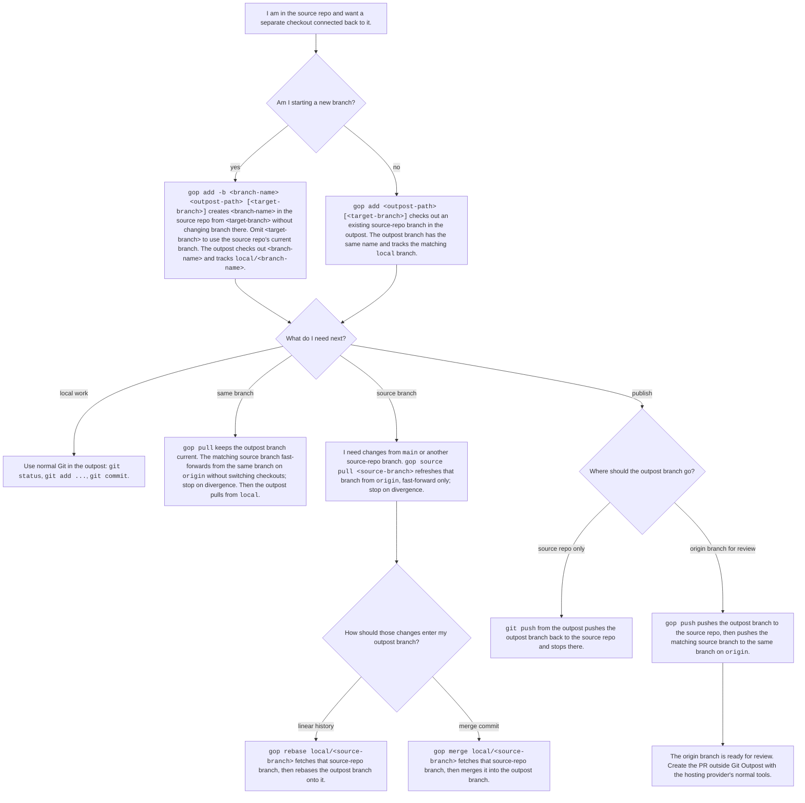

# Git Outpost

## Overview

Git Outpost is a Rust command-line tool installed with
`cargo install git-outpost`. It creates self-contained Git checkouts from an
existing local repository: a `git worktree`-like workflow backed by normal local
clones. Each outpost has its own `.git` directory, so devcontainers and editors
that expect a complete repository work without extra mounts. The canonical
binary is `git-outpost`; Git dispatches it as `git outpost`, and the package
also installs the short alias `gop`.

## Motivation

Git worktrees make parallel checkouts cheap: branches can be checked out side
by side while sharing one object database. That model breaks down in
containerized and editor-driven setups because a worktree's `.git` file points
to metadata outside the opened directory. Devcontainers often mount only the
project directory, editors inspect `.git` inside it, and machine-specific extra
mounts are brittle.

Git Outpost keeps the worktree-style workflow by creating normal local clones
from the source repository. Each outpost is self-contained, while the source
repository serves as its local remote so new checkouts do not need a fresh
GitHub clone.

## Goals

- Make adding another working checkout as simple as adding a Git worktree.
- Support the essential outpost lifecycle: add, pull, source pull, merge,
  rebase, push, list, lock, unlock, move, remove, prune, and status.
- Keep each outpost self-contained enough for devcontainers and editors.
- Avoid `git clone --shared`, because its object alternates still point outside
  the clone and can recreate the same portability issue as worktrees.
- Use regular Git commands and repository layouts wherever possible.
- Make the relationship between an outpost and its source repository explicit.
- Preserve access to the real upstream remote through the source repository.
- Keep ordinary Git available for the direct outpost-to-source hop, while
  providing dedicated `gop` commands for the Story's two-hop workflows.

## Non-Goals

- Replace Git.
- Implement a custom Git object store.
- Hide normal Git behavior from the user.
- Require a particular hosting provider such as GitHub.

## Core Model

An outpost is a normal Git clone created from another local repository:

```bash
git clone /path/to/source/repo /path/to/outpost
```

Inside the outpost, the source repository is configured as the outpost remote
named `local` by default. `--remote-name <name>` can override this where
applicable:

```text
local -> /path/to/source/repo
```

The outpost stores required local metadata that identifies it as managed by the
Git Outpost tool:

```ini
outpost.managed = true
outpost.sourceRepo = /path/to/source/repo
outpost.remoteName = local
```

The source repository keeps a required registry for listing, pruning, and safer
deletion:

```text
.outpost/registry.json
```

`gop add` creates or updates this file and locally ignores `.outpost/` in the
source repository so the registry is neither tracked project content nor copied
into outposts. This is Git Outpost's source-owned analogue to Git's
`.git/worktrees` registry.

### Artifact Ownership And Deletion

Git Outpost creates and configures only a small amount of local state.

Git Outpost always owns and removes these removable artifacts:

- the outpost directory
- the source registry entry for that outpost

`gop add -b` may create source-repo branches for tracking. Those branches are
not recorded as owned provenance after creation. Once created, they are
ordinary source-repository branches. `gop remove` may offer best-effort branch
cleanup, but only from proof derived at removal time: the outpost must still
track the configured source remote branch, the outpost and source branch tips
must match, the branch must not be checked out or be the upstream default
branch, and the branch must be proven merged by a merged pull request or by
local ancestry to the fetched upstream default branch. The user is prompted
before deleting the source branch, and prompted separately before deleting the
matching upstream `origin/<branch>` branch.

Git Outpost also writes source-local setup state: a local ignore entry for
`.outpost/` and `receive.denyCurrentBranch=updateInstead`. This setup state is
left in place unless the user changes it directly.

The deletion model is safe by default. Git Outpost must not discard working
tree changes, commits, or other user work silently. When deletion could lose
work, the tool should prefer refusing the operation over guessing.

## Story

The Story describes the normal outpost lifecycle: create a separate checkout,
do local work there, bring in source-repo updates when needed, and publish the
result back through the source repository.

The source repository keeps its usual upstream remote. The Story commands use
the remote named `origin` for source-to-upstream synchronization:

```text
origin -> git@github.com:OWNER/REPO.git
```

This creates a two-step flow:

```text
outpost <-> source repository <-> upstream remote
```



## Command Reference

The tool is installed with:

```bash
cargo install git-outpost
```

This places `git-outpost` on `PATH`, which Git dispatches as
`git outpost ...`. The package also installs `gop` for everyday use.

All three forms are equivalent:

```bash
git-outpost <command> [args...]
git outpost <command> [args...]
gop <command> [args...]
```

The remainder of this document uses `gop` because it keeps examples short.

## Synopsis

```text
gop [<global-options>] <command> [<args>...]

gop add [-b <new-branch>] [--remote-name <name>]
        <path> [<target-branch>]
gop pull
gop source pull <source-branch>
gop merge <source-ref>
gop rebase <source-ref>
gop push
gop list [-v|--verbose]
gop lock [--reason <string>] [<outpost>]
gop unlock [<outpost>]
gop move [-f|--force] <outpost> <new-path>
gop remove [-f|--force] [--no-branch-cleanup] <outpost>
gop prune [-n|--dry-run] [-v|--verbose]
gop status
```

The MVP keeps only the options that are meaningful for clone-backed outposts.
It does not mirror every `git worktree` option. Synchronization commands have
dedicated Story meanings; strategy flags are not added to `pull` or `push`
because `merge` and `rebase` are explicit commands.

## Working Directory Matrix

This matrix describes how `gop` treats each subcommand after applying any
global `-C <path>`. `/` means the command is supported there and has no
additional working-directory-specific behavior to explain.

| Subcommand | Source repo | Outpost |
| --- | --- | --- |
| `add` | / | Disallowed |
| `pull` | Disallowed | / |
| `source pull` | Disallowed | / |
| `merge` | Disallowed | / |
| `rebase` | Disallowed | / |
| `push` | Disallowed | / |
| `list` | / | Auto-resolves the source repo |
| `lock` | Requires `<outpost>` | May omit `<outpost>`; defaults to the current outpost |
| `unlock` | Requires `<outpost>` | May omit `<outpost>`; defaults to the current outpost |
| `move` | / | Disallowed |
| `remove` | / | Disallowed |
| `prune` | / | Disallowed |
| `status` | Disallowed | / |

## Commands

### `add <path> [<target-branch>]`

Create a self-contained outpost at `<path>` from the current repository. The
outpost is a normal local clone with its own `.git` directory; the current
repository is configured as the outpost's local source remote.

`<target-branch>` names a branch in the source repository. When it is omitted,
`add` uses the source repository's current branch. The command does not switch
the source repository's checkout.

Default checkout behavior:

- Without `-b`, check out an existing source-repo branch in the outpost. The
  outpost branch has the same name and tracks `<remote-name>/<branch>`.
- With `-b <new-branch>`, create `<new-branch>` in the source repository from
  `<target-branch>`, or from the source repository's current branch when
  `<target-branch>` is omitted. The source repository remains on its current
  checkout. The outpost checks out `<new-branch>` and tracks
  `<remote-name>/<new-branch>`.

The destination must be absent or empty; no add option overrides this rule.
Uncommitted source working tree changes are not copied into the outpost. An
omitted target branch requires the source repository's `HEAD` to be attached to
a branch. An unborn source `HEAD` is rejected in the MVP.

`--remote-name <name>` uses `<name>` for the source repository remote inside
the outpost. Defaults to `local`.

`gop add` records outpost metadata, updates the source registry, and locally
ignores `.outpost/` in the source repository. It also configures the source
repository with `receive.denyCurrentBranch=updateInstead` so ordinary
`git push` from an outpost can update a branch that is checked out in the
source repository. This source-side config write must be visible in command
output. There is no MVP flag to disable it; users who need a different policy
can change the Git config directly.

### `pull`

Keep the current outpost branch current with the matching source branch and
the same branch on `origin`.

`gop pull` runs from a managed outpost on an attached branch. It first
fast-forwards the matching source-repo branch from `origin/<branch>` without
switching the source repository's checkout, and stops on divergence. It then
pulls the outpost branch from `<remote-name>/<branch>`, also fast-forward only.
It does not choose a merge or rebase strategy; use `gop merge` or `gop rebase`
for that.

### `source pull <source-branch>`

Refresh `<source-branch>` in the source repository from the same branch on
`origin` without switching checkouts. The update is fast-forward only and stops
on divergence. This command is useful before bringing another source branch,
such as `main`, into the current outpost branch with `gop merge` or
`gop rebase`.

### `merge <source-ref>`

`gop merge` runs from a managed outpost on an attached branch. It fetches the
source-repo branch named by `<source-ref>`, then merges that ref into the
current outpost branch. The expected form is a ref on the configured source
remote, such as `local/main`.

`gop merge` does not refresh the source branch from `origin`. Run
`gop source pull <source-branch>` first when the source branch should be
updated.

### `rebase <source-ref>`

`gop rebase` runs from a managed outpost on an attached branch. It fetches the
source-repo branch named by `<source-ref>`, then rebases the current outpost
branch onto that ref. The expected form is a ref on the configured source
remote, such as `local/main`.

`gop rebase` does not refresh the source branch from `origin`. Run
`gop source pull <source-branch>` first when the source branch should be
updated.

### `push`

Publish the current outpost branch for review. `gop push` runs from a managed
outpost on an attached branch. It pushes the outpost branch to the matching
branch in the source repository, then pushes that source branch to the matching
branch on `origin` and records the source branch's upstream as
`origin/<branch>`. The matching branch in the source repository must already
exist; `gop push` refuses a branch that exists only in the outpost rather than
creating it in the source repository.

Use ordinary `git push` from the outpost when the branch should stop at the
source repository and not be published upstream.

### `list`

List outposts registered to the current source repository. The default output
shows one outpost per line and should include:

- outpost path
- current branch
- dirty or clean state
- ahead/behind state relative to the local source repository
- whether the outpost path still exists

With `-v`, include lock reasons and other human-readable annotations. Stable
machine-readable list output is deferred until the fields have settled.

When run in a managed outpost, `list` resolves the source repository from
outpost metadata and produces the same output as running `list` in that source
repository.

### `lock [--reason <string>] [<outpost>]`

Lock a managed outpost so cleanup commands cannot remove or move it
accidentally. The path must identify a registered outpost of the current source
repository. `--reason <string>` stores an explanation for the lock in the
source registry.

When run in a source repository, `<outpost>` is required. When run in a managed
outpost, omitting `<outpost>` locks the current outpost.

Locked outposts are kept by `prune`. `move` and `remove` refuse locked
outposts unless `--force` is passed. Lock state is advisory to Git Outpost; it
does not affect normal Git commands or filesystem tools.

### `unlock [<outpost>]`

Unlock a managed outpost. The path must identify a registered outpost of the
current source repository. The command clears the registry lock state and lock
reason, and leaves repository files untouched.

When run in a source repository, `<outpost>` is required. When run in a managed
outpost, omitting `<outpost>` unlocks the current outpost.

### `move <outpost> <new-path>`

Safely move a managed outpost directory. The path must identify a registered
outpost of the current source repository; the command does not move arbitrary
unregistered paths. The destination must be absent or empty.

By default, `move` refuses dirty or locked outposts. `-f`/`--force` allows the
move despite dirty state or a lock. After the filesystem move succeeds, Git
Outpost updates the source registry entry to the new path and preserves the
outpost's existing lock state.

### `remove <outpost>`

Safely remove a managed outpost. The command refuses dirty outposts, outposts
with unpushed commits, and locked outposts by default. After safety checks pass,
it removes the source registry entry and deletes the outpost directory.

In interactive terminals, `remove` then analyzes the outpost's tracked source
branch and prompts before branch cleanup when it can prove deletion is safe. It
deletes the local source branch with an exact-OID guard, so a branch that moves
during cleanup is left intact. If `origin/<branch>` exists at the analyzed OID,
the command prompts separately before deleting the upstream branch with
`--force-with-lease`. If proof is missing, prompts are declined, the command is
non-interactive, or cleanup fails after the outpost directory is removed,
outpost removal still succeeds and branches are left intact or reported as
warnings. The CLI prints branch-cleanup diagnostics to stderr after the stable
stdout result `removed <path>`, including skipped cleanup reasons and declined
prompts. When `gh` is not installed or unavailable, merged-PR proof is reported
as unavailable and cleanup falls back to local Git proof.

`-f`/`--force` allows removal despite dirty state, unpushed commits, or a lock.
It does not weaken branch cleanup proof. `--no-branch-cleanup` disables branch
cleanup analysis and prompts.

### `prune`

Clean stale registry entries for outpost paths that no longer exist. Locked
entries are kept. The command reports outposts whose source repository no
longer exists and does not delete real directories or source-repo branches.

`-n`/`--dry-run` reports what would change without saving the registry. `-v`
reports each pruned registry entry. `prune` removes stale registry entries, not
stale clones.

### `status`

Summarize the current managed outpost. `status` is not a replacement for
`git status` and does not list file-level changes. It is read-only and does not
fetch, pull, push, stash, or update refs.

Output should include:

- outpost path
- source repository path, or that it is not configured
- source remote name inside the outpost
- current branch, or detached `HEAD` state
- clean or dirty working tree state
- ahead/behind state relative to the source repository, or why it is unavailable
- source branch ahead/behind state relative to its upstream, based on existing
  local refs, or why it is unavailable
- a short health line: `ok` or the blocking configuration problems found while
  building the summary

Status operates on the current directory. Use `gop -C <path> status` to
inspect another outpost.

## Synchronization

Git Outpost keeps ordinary Git available for the direct outpost-to-source hop.
From an outpost, ordinary Git talks only to the source repository: `git pull`
updates the outpost from the source repository, and `git push` pushes the
current outpost branch only to the source repository.

```bash
git pull
git push
```

Git Outpost commands cover the Story's dedicated two-hop workflows:

```bash
gop pull
gop source pull main
gop rebase local/main
gop merge local/main
gop push
```

Each command reports the user-visible cross-repository step it is about to run
so network and source-repository mutations stay visible. Internal safety
fetches may be unreported when they are implementation preconditions rather
than user-visible workflow steps.

## Options

### Global Options

`-C <path>`

Run as if Git Outpost was started in `<path>`.

`--no-color`

Disable colored output. The tool also honors `NO_COLOR`.

### Shared Command Options

`-v`
`--verbose`

With `list`, include extended annotations such as lock reasons. With `prune`,
report each pruned registry entry.

## Deferred Or Removed Surface

The following surfaces are intentionally outside the MVP:

- `gop add -B` is removed. Resetting a branch is useful in shared worktrees but
  is weak or dangerous for a fresh clone-backed outpost.
- `gop add -f` is removed. The destination must be absent or empty.
- `gop add --checkout` is removed because checkout is the default.
- `gop add --no-update-instead` is removed because it controls source
  repository policy, not the new outpost.
- `gop add --detach`, `gop add --no-checkout`, `gop add --orphan`, and
  add-time `--lock` are deferred until there is a concrete workflow that
  justifies the extra state.
- `gop list --porcelain`, `gop list -z`, global `--json`, and global
  `--quiet` are deferred until output/event policy is designed. Mandatory
  cross-repo visibility must not be silently hidden.
- `gop list --all` is deferred until there is a global registry model.
- `gop prune --expire` is removed. Missing outpost directories are not Git
  administrative debris; `lock` and `prune -n` are the MVP safety controls.
- `gop pull --update-source`, `gop pull --rebase`, `gop pull --merge`,
  `gop pull --autostash`, `gop push --to-upstream`,
  `gop push --source-branch`, and `gop push --upstream-remote` are removed from
  the planned product surface. Use `gop pull`, `gop source pull`,
  `gop merge`, `gop rebase`, ordinary `git push`, or the dedicated two-hop
  `gop push` instead.

Commands that accept `<outpost>` identify a managed outpost by path. Paths may
be absolute or relative to the current working directory. For `lock` and
`unlock` from a managed outpost, omitting `<outpost>` means the current outpost.
